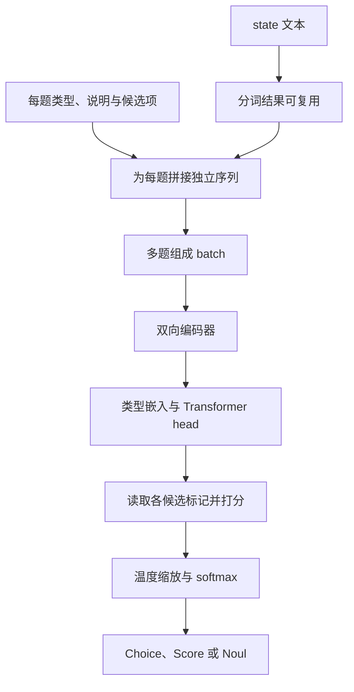

我们在做一个 Agent 工作台，最早是通过 Skills 来分流请求，再交给具体的 Agent。问题是，在真正进入目标 Agent 之前，界面上常常会先出现很长一段思考或其他输出。这既拖慢了响应，也容易让用户看得一头雾水：我只是提了个需求，系统怎么先说了这么多？

后来，我们改成通过参数注入 System Prompt，响应明显快了起来，目前采用的就是这套方式。不过，分流逻辑仍放在 Agent 外部，由 Web、CLI 等入口各自维护，还没有成为 Agent 内部的一条统一流程。

随着知识库和预设 Prompt 越来越丰富，需要统一选择的也不只是角色。查产品资料、整理方案、排查问题，背后适合调用的知识库、提示词和处理方式都可能不同。让不同入口分别维护这层判断，既增加维护成本，也容易让同一个需求走出不同的处理路径。

**下一步，是让各个入口共用 Agent 内部的路由流程，再为这一步挑一个合适的决策模型。** 可以先由专门的决策模型判断该用哪些知识库、匹配哪个预设 Prompt，再由执行层读取配置、检索资料，把任务交给准备妥当的 Agent。Web、CLI 等入口负责接收请求，路由判断则在同一套流程里完成。

如果这套流程跑通，用户从熟悉的入口提出需求，系统就能统一准备合适的知识与方法。路由选得准、走得快，用户也就能少翻几遍目录、少补几次说明，少经历一次“选错了，重来”。

候选现在有四个：Jev、Laya、Clef 27B 和 Clef-Flash 9B。它们都想把“先判断一下”做得更直接，但交付方式、模型底座、输入能力和计算开销并不相同。我们先弄清它们分别在做什么，再把公开评测和部署条件放回同一张桌子上。小路由器要选得称手，不能只看谁的名字后面跟着更大的数字。

<!-- truncate -->

## 三条路线，四个候选

Jev 来自 TypeSafe AI。创始人 Diogo Almeida 曾参与 InstructGPT 相关工作，团队在 2026 年 9 月 15 日公布 Jev，并开放 early access。他们把这一产品方向命名为 **System One models**，强调快速、结构化、软件可以直接使用的判断结果。<a href="#ref-1" aria-label="引用 1">[1]</a>

这里的 System One 借用了“快速直觉判断”的说法。它不是一份统一的行业标准，也不意味着模型已经复现了人的两套认知系统。分类器、编码器和概率校准本来就存在；这次更值得讨论的是，它们如何被组合成一种通用的开发接口。

随后出现的 Laya，由 ConvAI Innovations 的 Nandakishor Mukkunnoth 开发，代码位于 `NandhaKishorM/laya`。作者把自己的路线追溯到早期销售对话转化预测研究，并明确说，Jev 发布之后，他决定把已有经验扩展成更通用、开放的决策模型。PyPI 上 `laya` 的 0.1.0 发布于 9 月 18 日，这是软件包的首发日期，不能直接当作所有权重的开放日期。<a href="#ref-2" aria-label="引用 2">[2]</a>, <a href="#ref-3" aria-label="引用 3">[3]</a>

因此，可以说 Laya 的公开项目出现在 Jev 之后，接口和产品方向也明显受到启发；目前没有公开证据表明，它继承了 Jev 的代码、权重或训练实现。两边都使用 RLCD 这个名字，也不能据此认定训练算法相同。

Cloudflare 在 2026 年 10 月 1 日发布的 Clef，则带来了另一条路线：把较大的 Qwen 模型改造成直接输出决策分数的模型。Clef 27B 基于 Qwen3.8-27B，Clef-Flash 9B 基于 Qwen3.5-9B；两者均以 Apache-2.0 开放权重。它们与 Laya 同样可以自行部署，也提供 Workers AI 托管入口。<a href="#ref-4" aria-label="引用 4">[4]</a>, <a href="#ref-5" aria-label="引用 5">[5]</a>, <a href="#ref-6" aria-label="引用 6">[6]</a>, <a href="#ref-7" aria-label="引用 7">[7]</a>, <a href="#ref-8" aria-label="引用 8">[8]</a>

这样看，三个名字对应四个候选。Jev 以托管服务交付，核心权重未公开；Laya 以较小的编码器和开放实现起步；Clef 家族则把更大的多模态底座带进决策任务。TypeSafe 的 SDK 开源，也仍然不等于 Jev 模型本身开源。<a href="#ref-9" aria-label="引用 9">[9]</a>, <a href="#ref-10" aria-label="引用 10">[10]</a>, <a href="#ref-5" aria-label="引用 5">[5]</a>, <a href="#ref-6" aria-label="引用 6">[6]</a>

| 维度 | Jev | Laya | Clef 27B | Clef-Flash 9B |
| --- | --- | --- | --- | --- |
| 模型路线 | 核心架构与参数规模未完整公开 | 英语版 ModernBERT-large，约 421M；多语版 mmBERT-base，约 322M | Qwen3.8-27B 底座 | Qwen3.5-9B 底座 |
| 交付方式 | TypeSafe 托管 API | 开放代码与权重，可本地或自托管 | 开放权重，原生 Python、Ollama、Workers AI 等入口 | 同一 Clef 家族的较小模型，同样有本地与托管入口 |
| 输入能力 | 文本 | 以文本决策为主 | 原生模型支持文本/JSON、图片与视频；具体入口另看接口 | 原生模型支持文本/JSON、图片与视频；具体入口另看接口 |
| 开放与适配 | SDK 开放；不能自行微调托管权重 | 可检查实现与领域微调；核对所用模型许可和 revision | 模型卡标注 Apache-2.0 | 模型卡标注 Apache-2.0 |
| 选型时先看 | 网络、限流、版本与数据传输 | checkpoint、截断、校准与自托管吞吐 | 较大模型的资源开销是否换来所需决策质量 | 较小模型的速度与成本收益，是否伴随可接受的质量差距 |

架构和许可据模型卡、代码与接口文档整理。<a href="#ref-11" aria-label="引用 11">[11]</a>, <a href="#ref-12" aria-label="引用 12">[12]</a>, <a href="#ref-13" aria-label="引用 13">[13]</a>, <a href="#ref-14" aria-label="引用 14">[14]</a>, <a href="#ref-5" aria-label="引用 5">[5]</a>, <a href="#ref-6" aria-label="引用 6">[6]</a>, <a href="#ref-15" aria-label="引用 15">[15]</a>, <a href="#ref-7" aria-label="引用 7">[7]</a>, <a href="#ref-8" aria-label="引用 8">[8]</a> 表里的“较小”也要看比较对象：9B 小于 27B，却仍远大于 Laya 的几亿参数版本；不能因为叫 Flash，就默认它在任何机器上都轻巧。

先选服务还是先管模型，是第一道工程选择。接下来还要问：同一份请求送进去，它们究竟返回什么？

## 先把路由问题写成一道好题

普通聊天模型擅长把答案展开讲。到了路由这一步，我们往往只想知道几件事：选哪组资源、用哪个 Prompt、信息够不够。这四个模型都把这些简短的判断当成主要工作，而不是先写一大段解释，再让程序从里面找答案。

你提供 `state`，也就是这次判断需要的请求和上下文；再提供 `questions`，写清问题、候选项或评分等级。这里的 state 是**本次调用传入的内容**，不代表模型已经记住了工作台里的全部知识。Jev 和 Laya 的接口主要围绕三个原语组织：<a href="#ref-16" aria-label="引用 16">[16]</a>, <a href="#ref-17" aria-label="引用 17">[17]</a>

| 原语 | 放到 Agent 工作台可以问什么 | 输出的含义 |
| --- | --- | --- |
| Choice | 当前任务最适合哪个候选 Prompt？ | 选择一个候选项，并返回各选项的概率 |
| Score | 用户提供的信息够不够开始处理？ | 返回有序等级上的评分及概率分布 |
| Noul | 这项任务是否需要查内部知识库？ | 返回“是”的概率，范围为 0 到 1 |

Clef 也提供结构化决策，但不能只凭“System One”这个名字就假定所有字段可以直接互换。以 Ollama 的 `/v1/systemone` 为例，请求同样包含 `state` 与 `questions`，候选分类、序数评分和布尔判断都有明确结构；原生 Python、Workers AI 与 Ollama 的参数和返回格式则需要各自对齐。选模型时，也要把适配器一起选好。<a href="#ref-5" aria-label="引用 5">[5]</a>, <a href="#ref-15" aria-label="引用 15">[15]</a>

连候选数量和字段语义也有区别：Jev 的 Choice 最多支持 255 个选项，而 Ollama 的决策端点对 choice/score 使用 2–26 个候选或等级。Jev 明确把问题 ID 当响应键，不参与推理；Clef 原生示例在省略 instructions 时可以使用问题 ID。最稳妥的做法，是显式写清题意、校验预算，再转换结果，别把“形状相似”当成“只改模型名就能换”。<a href="#ref-18" aria-label="引用 18">[18]</a>, <a href="#ref-15" aria-label="引用 15">[15]</a>, <a href="#ref-19" aria-label="引用 19">[19]</a>, <a href="#ref-5" aria-label="引用 5">[5]</a>

Score 需要先写好等级，例如“目标不明”“目标明确但缺关键条件”“已经可以开始”。它适合这种有序判断，不能当成任意实数计算器。<a href="#ref-20" aria-label="引用 20">[20]</a>

举个假设例子：用户说“帮我查一下产品 A 的接入限制，再整理一份给客户看的说明”。系统可以先给出一小份候选目录，里面包括产品文档库、接入常见问题库，以及“技术排查”“客户说明”等 Prompt 的用途描述。模型据此判断哪些资源更合适，后续程序再去读取配置、检索正文、组装任务。

**目录负责告诉它去哪找，检索负责真的把资料找回来。** 这四个模型都不会因为拿到了一个知识库名称，就自动拥有其中的全部内容。

现代生成模型也能提供结构化输出。这里值得关注的是计算方式：这些决策模型把判断或分数作为直接输出，省去逐 token 写出答案的过程；确定性的配置、权限和执行逻辑，则继续由代码负责。

有些问题还可以一起问。Jev 文档建议把能独立判断的问题放在同一次请求里，例如“是否需要检索”和“用户有没有说明输出对象”，减少串行往返。<a href="#ref-21" aria-label="引用 21">[21]</a> 但如果后一个判断依赖前一个答案，就要显式处理这种依赖。并行回答也不保证每项结果天然一致，互斥关系和业务约束仍需要代码检查。

## 同样少说话，计算方式并不一样

### Jev 把判断直接作为输出

TypeSafe 对外披露了非自回归的并行输出方式，以及名为 RLCD（Reinforcement Learning for Calibrated Decisions）的训练方向。目标是让模型直接给出决策分布，而不是逐 token 写完答案。<a href="#ref-11" aria-label="引用 11">[11]</a>

但截至本文整理时，公开资料没有给出足够完整的核心架构、参数规模和训练配方。我们可以讨论它的外部行为，不能把它画成一个已经确认的“小型 BERT”，更不能因为输出短，就把本文四个模型都统称为“小语言模型”。

当前文档列出的 Jev 1.13 接受文本；单次请求总预算为 64k tokens，`state` 加最长一个问题的预算为 32k。它不直接读取图片或音频，客户也不能自行对托管权重做 LoRA 微调。实际使用时，应固定版本并记录响应中的模型 ID，避免别名更新后阈值悄悄失效。<a href="#ref-9" aria-label="引用 9">[9]</a>

### Laya 让我们看见计算发生在哪里

Laya 的英语基础版采用 ModernBERT-large，约 4.21 亿参数；多语版采用 mmBERT-base，约 3.22 亿参数。仓库提供 Apache-2.0 代码，所列模型卡也标注相应的开放权重许可。部署时仍应核对自己实际下载的模型与 revision。<a href="#ref-12" aria-label="引用 12">[12]</a>, <a href="#ref-13" aria-label="引用 13">[13]</a>, <a href="#ref-14" aria-label="引用 14">[14]</a>

从公开代码看，每个问题的类型、说明、候选项和 state 会拼成一条输入序列。候选项前插入标记，整个序列经过双向编码器与额外的 Transformer 层，再读取各候选标记位置的表示，输出 logits，经温度缩放和 softmax 得到概率。直观地说，它读完题目和材料就直接给选项打分，省去了逐 token 生成答案的解码循环。<a href="#ref-22" aria-label="引用 22">[22]</a>, <a href="#ref-23" aria-label="引用 23">[23]</a>

这也说明，接口支持多题，不等于底层上下文编码只计算一次。Laya 的多题可以批量前向，但每题仍会重复编码包含 state 的序列。共享的是分词缓存，不能把它理解成“上下文只计算一次，之后加多少问题都免费”。<a href="#ref-24" aria-label="引用 24">[24]</a>

候选项描述也会消耗 token 预算。默认英语 checkpoint 的总长度为 512，多语为 1,024；问题与选项占去一部分后，剩下的空间才用于 state。很长的候选列表可能压缩描述，过长的字符串或对象 state 默认可能丢掉尾部信息；列表形式的对话则优先保留最近内容。即使底层模型能接受更长上下文，也要检查实际配置和截断情况。<a href="#ref-22" aria-label="引用 22">[22]</a>, <a href="#ref-17" aria-label="引用 17">[17]</a>

想继续看看训练过程，可以从 Laya 公开的 typed-decisions 微调脚本读起：它对 logits 施加扰动，用 log score、spherical score，以及有序评分任务的 ranked probability score 构造奖励，再把基于奖励的更新与交叉熵目标组合起来。之后还可以拟合温度。这个实现说明 RLCD 不只是接口名字，但它并不能证明所有历史权重都严格由同一份脚本训练而来，更不能替我们推断 Jev 的训练细节。<a href="#ref-25" aria-label="引用 25">[25]</a>

### Clef：大底座，也可以只做决策

Clef 27B 和 Clef-Flash 9B 利用各自 Qwen 底座的理解能力，在 prefill 后由 joint schema head 读取底座表示，为允许的选项打分，再按每道题做 softmax 得到概率，不进入逐 token 生成答案的循环。这里的“非自回归”描述的是这条决策输出路径；底座大、理解范围广，并不妨碍它只交一份很短的答卷。<a href="#ref-5" aria-label="引用 5">[5]</a>, <a href="#ref-6" aria-label="引用 6">[6]</a>, <a href="#ref-4" aria-label="引用 4">[4]</a>

Cloudflare 公开的训练说明还提到：冻结 Qwen 底座，联合训练决策 head 与 rank 256 的适配器，使用交叉熵、Brier 和 RLCD 相关目标。这解释了它为何重视有边界的输出与概率质量，但训练目标本身不能替代业务数据上的校准验收。<a href="#ref-4" aria-label="引用 4">[4]</a>

它们也因此多了一种用途：当选择依据不只有文字，而是一张界面截图、商品图片或视频片段时，原生多模态输入可以直接参与判断。模型卡中的能力范围要与部署接口分开看：原生 Python 示例包含视频；Workers AI 的已公开请求结构暴露图片字段，不能把简介里的视频能力直接当成已验证的托管视频接口。<a href="#ref-5" aria-label="引用 5">[5]</a>, <a href="#ref-6" aria-label="引用 6">[6]</a>, <a href="#ref-7" aria-label="引用 7">[7]</a>, <a href="#ref-8" aria-label="引用 8">[8]</a>

Ollama 又是一套更窄的约束。Clef 支持要求 Ollama 0.35.1 或以上，使用 GGUF 与专用评分 runner，走本地 `/v1/systemone`。图片传原始 base64 编码的 PNG、JPEG 或 WebP，不是图片 URL 或 data URL；这个端点不提供流式生成、视频输入、工具调用或常规生成参数。它遇到超长输入会拒绝，而不是静默截断。<a href="#ref-15" aria-label="引用 15">[15]</a>, <a href="#ref-26" aria-label="引用 26">[26]</a>

因此，27B 和 9B 的选择不是“够不够装得下”这一问就结束了。还要把输入长度、图片处理、并发、量化方式和目标质量一起放进测试。省掉解码循环很有价值，但 prefill 仍要计算。模型可以少说话，计算开销却不会自动消失。

## 概率很漂亮，也要问一句准不准

假设一组预测都给某个事件分配了 0.8 的概率。如果长期看，这类事件大约有 80% 真正发生，才可以说这部分预测比较校准。它描述的是一批预测的统计关系，无法给某一次决策提供正确保证。<a href="#ref-11" aria-label="引用 11">[11]</a>

还有一个容易混淆的地方：probability 和 `confidence` 要分开看。

按当前 Jev 文档，Choice 和 Score 的 `confidence` 是从已有概率分布计算出的摘要；Noul 没有单独的 `confidence` 字段。别把这个字段理解成模型额外做了一次“我有没有看懂”的检查。分布很集中，说明模型倾向某个答案，但它也可能很笃定地选错。<a href="#ref-27" aria-label="引用 27">[27]</a>

Laya 当前实现又采用不同定义：`confidence` 根据归一化熵衡量分布集中程度，`answer_confidence` 才是所选答案的概率，拒答阈值主要使用后者。字段名称相近，计算方式却不同，不能直接把一家的阈值搬到另一家。<a href="#ref-22" aria-label="引用 22">[22]</a>, <a href="#ref-28" aria-label="引用 28">[28]</a>

因此，“输出一定符合类型”和“语义判断正确”是两层保证。模型可以把答案限制在提供的候选项里，但仍然可能选错资源。输入里藏着诱导指令，也可能把答案推向错误方向。Jev 官方的已知问题页面就列出了对抗内容、数值精度、日期比较和无关长上下文带来的失败。<a href="#ref-29" aria-label="引用 29">[29]</a>

Clef 同样需要这一步检查。它直接给出分数或概率，并没有绕过校准问题。换量化版本、换输入模态、换部署入口，旧阈值都值得重新验证。对于路由，真正有用的问题是：在允许自动执行的那一部分请求里，错误率有多高？“这个数看起来很自信”，还不够让它替用户按下按钮。

## 四个模型，公开评测能回答什么

### Cloudflare 把四个候选放进了同一份评测

Clef 模型卡列出了内部 Decision Index 0.2.1 结果，发布文章也给出多个任务上的对照。下面摘录发布文章中的四个模型列。各项数字以百分数表示，但指标不同：case exact 看整例是否完全匹配，macro-F1 看类别表现，nDCG@10 看排序质量。不能把它们相加，算一个自己的“总冠军分”。<a href="#ref-4" aria-label="引用 4">[4]</a>, <a href="#ref-5" aria-label="引用 5">[5]</a>, <a href="#ref-6" aria-label="引用 6">[6]</a>

| 任务 / 指标 | Jev | Laya（发布方所列） | Clef 27B | Clef-Flash 9B |
| --- | --- | --- | --- | --- |
| BFCL / case exact | 95.75 | 38.13 | 98.47 | 98.76 |
| ToolRet / nDCG@10 | 65.28 | 12.69 | 69.19 | 66.43 |
| API-Bank / accuracy | 88.19 | 11.41 | 91.93 | 93.11 |
| Home appliances / case exact | 52.27 | 0.00 | 82.95 | 97.73 |
| When2Call / accuracy | 80.97 | 11.94 | 72.37 | 65.58 |
| BANKING77 / macro-F1 | 79.74 | 14.29 | 94.20 | 90.93 |
| CLINC150+OOS / macro-F1 | 89.27 | 3.19 | 97.43 | 66.77 |
| BRIGHT / nDCG@10 | 47.52 | 19.90 | 45.91 | 39.26 |
| Amazon ESCI / macro-F1 | 55.21 | 24.40 | 57.48 | 57.39 |
| PhishNChips / accuracy | 62.55 | 50.15 | 79.60 | 75.05 |

这些是 Cloudflare 发布的对照结果，不是本文的新实测，也不是独立复现。所查表格未完整给出 Jev/Laya 的精确版本、Laya checkpoint、各模型运行配置和输入长度，所以 Laya 那一列不能代表它的所有基础版、多语版和微调版。统一任务集合有助于比较，仍不能自动保证环境条件完全一致。<a href="#ref-4" aria-label="引用 4">[4]</a>, <a href="#ref-5" aria-label="引用 5">[5]</a>

不过，这张表已经能帮我们提出更具体的问题。Clef 27B 在 BANKING77、CLINC150+OOS 等任务上有优势；Flash 9B 在 BFCL、API-Bank 和 Home appliances 上反而高于 27B。Jev 则在 When2Call 和 BRIGHT 上领先这两个 Clef 版本。模型大小、任务类型和得分之间，没有一条处处成立的直线。

对路由尤其值得留意的是家族内部的差距。模型卡中 RouterBench 的 selected-quality 分数，Jev / Clef / Flash 为 79.9 / 79.7 / 79.9，十分接近；换到 RAGTruth hallucination F1，则为 76.5 / 79.4 / 35.6。Flash 在某种路由选择上接近 27B，不代表它在所有判断上都能平替。<a href="#ref-6" aria-label="引用 6">[6]</a>

多步工作流还需要把“答对”的口径写全。同一份 Clef 模型卡里，发票流程的 exact actions 分数是 Clef 64.7、Flash 57.1、Jev 61.8；只看 primary action 时变为 86.2、73.3、83.1。Agent trace 的 primary action 则是 68.5、69.8、71.6。它们使用共识参考标签，不能统统改写成一个笼统的“准确率”，也不能拿去与 Laya 另一套 typed-decisions 实验直接拼榜。<a href="#ref-5" aria-label="引用 5">[5]</a>

### 先分清宣传数字与同场测试

Jev 发布时给出了 193.6 倍提速、444.6 倍降本的宣传数字。它们来自团队设计的四类工作流，参考答案由强模型预测聚合而来；因此度量包含“与参考模型的一致程度”，不能直接读作人工核验的业务正确率。官方也承认这些收益接近实际场景中较高的一端，使用完整概率输出的 LLM 对照会增加生成成本。<a href="#ref-1" aria-label="引用 1">[1]</a>, <a href="#ref-30" aria-label="引用 30">[30]</a>

有了公开代码和数据，我们可以继续检查这些数字。不过，测试位置、工作流拆分方式和对照输出要求都影响结果，不能把宣传倍数搬到每个 API 请求上。当前 Jev 原生 API 标价为每百万输入 tokens 0.042 美元，输出不另收费；用在自己的业务里是否划算，还要把输入量、重试和回退比例一起算进去。<a href="#ref-9" aria-label="引用 9">[9]</a>

Laya 首页上的分数，也需要连同测试条件一起读。项目的 `BENCHMARKS.md` 明确注明，表里的 Jev 分数引用第三方报告，部分提示词和样本数不同。typed-decisions 的 0.766 来自专项微调 checkpoint，而且尚未附对应的原始结果文件；同任务、2,000 个决策上，本文所引固定版本 T4 记录里的基础英语版为 0.362，多语版为 0.3515，多数类基线为 0.461。把微调后的 0.766 当作基础模型零样本能力，会误判部署难度。<a href="#ref-31" aria-label="引用 31">[31]</a>, <a href="#ref-32" aria-label="引用 32">[32]</a>

### 独立的 Jev–Laya 对照，保留它自己的版本条件

`elcronos/jev-vs-open-decision-models` 在 9 月 20 日记录了同一套分类协议，并公开逐样本结果、API 响应缓存和环境快照。下面取它的 plain 设置：英语短文本、一个 Choice 问题、原始标签顺序、无示例或专项调优。<a href="#ref-33" aria-label="引用 33">[33]</a>, <a href="#ref-34" aria-label="引用 34">[34]</a>

模型版本需要一起读：Jev 使用 `typesafe/jev-1.13-20260917`；Laya 使用 **0.3.3 软件包及当时的英语基础权重**，权重 revision 为 `c5d7873…`。它没有测试后来的 0.3.23、多语模型或专项微调权重。<a href="#ref-35" aria-label="引用 35">[35]</a>

表中每格为 **准确率 / Macro-F1**，均换算为百分数；N 是测试文本条数，K 是候选类别数。

| 数据集 | N / K | Jev | Laya 英语基础版 |
| --- | --- | --- | --- |
| DAIR Emotion | 2,000 / 6 | 58.65 / 50.02 | 58.70 / 49.29 |
| Tweet Topic | 1,693 / 6 | 79.33 / 69.36 | 63.20 / 46.11 |
| Financial News Topic | 4,117 / 20 | 66.99 / 62.98 | 34.20 / 36.23 |
| DailyDialog 单句情绪 | 7,740 / 7 | 70.99 / 38.47 | 61.43 / 27.48 |

表中数据整理自公开评测，未重新运行推理。<a href="#ref-36" aria-label="引用 36">[36]</a>公开训练数据清单仍不完整，同协议也不能证明测试内容从未被模型接触。

它给出的信息比“谁全面领先”更具体：Emotion 上，两者准确率只差一条样本，未检出显著差异；其余三个设置中，这一版 Jev 的表现更好。但 DailyDialog 的大多数样本属于“无情绪”，永远选多数类就能得到 **81.67%** 准确率，且测试没有给模型对话上下文。只看总准确率，容易忽略少数情绪识别能力。<a href="#ref-37" aria-label="引用 37">[37]</a>

概率也没有天然变得可信。金融分类里，Laya 的最高类别概率均值约 **95.2%**，准确率却只有 **34.2%**，ECE15 为 **0.6096**。这个旧版本结果不能代表当前版本的校准表现，但足以提醒我们：读取到一个很大的概率值，不等于已经拿到了可以直接上线的风险阈值。<a href="#ref-38" aria-label="引用 38">[38]</a>

如果业务已经有稳定标签和训练数据，还应该把传统分类器放进对照组。同一项目的补充实验中，经过有监督训练的 TF-IDF 加逻辑回归，在金融分类上达到 82.75%。它与零样本模型的训练条件不同，但说明选型时仍然值得问：这个固定任务，需要多大的模型？<a href="#ref-39" aria-label="引用 39">[39]</a>

### 中文结果有参考价值，但目前只覆盖 Jev 与 Laya

更贴近中文开发者的是 `zh-decision-bench` v0.2。它包含 378 条材料、467 个问题，分别测试语音指令文本路由与几类业务判断。下表覆盖五类问题，每格为 **准确率 / ECE15**；ECE 越低表示这项测试里的分箱校准误差越小。

| 中文任务 | N | Jev | Laya 多语版 |
| --- | --- | --- | --- |
| 语音指令文本路由 | 323 | 0.960 / 0.035 | 0.870 / 0.056 |
| 客服路由 | 34 | 0.882 / 0.107 | 0.618 / 0.311 |
| 客服紧急程度 | 34 | 0.676 / 0.135 | 0.647 / 0.088 |
| 诈骗或违规推广 | 21 | 0.952 / 0.073 | 0.714 / 0.286 |
| 是否升级处理 | 55 | 0.600 / 0.164 | 0.564 / 0.230 |

表中数据按公开评测记录整理。<a href="#ref-40" aria-label="引用 40">[40]</a>N 为该项问题数。测试使用 Laya 0.3.20；Jev 只记录了 `jev-latest` 别名，未保留解析后的版本，Laya 权重 revision 也未存档。

这些结果最值得带走的提醒，是用自己的中文场景验收，还不能据此排出通用的语言能力榜单。语音路由来自 MASSIVE 映射，业务部分是合成材料，由单人裁定标签；尤其只有二三十条样本的分组，不确定性更大。紧急程度这一行也提醒我们，准确率与校准可以朝不同方向变化。

### 毫秒级的快，快在哪一段

Cloudflare 公布的请求延迟中，Jev、Laya、Clef 27B、Flash 9B 的中位数分别为 524.1、5.8、209.3、38.8 ms；P95 分别为 536.0、222.5、238.6、122.4 ms。<a href="#ref-4" aria-label="引用 4">[4]</a> 这里先别急着用两个中位数相除：所查表格不足以还原每个模型的硬件、批量、输入长度、网络位置与冷热状态。这些数不能当成自己的 Ollama 实测，更不能当成用户拿到最终结果的耗时。

上述第三方测试里，Emotion 的 Jev P50 为 349.09 ms，Laya 为 31.30 ms。前者是澳大利亚客户端以并发 8 访问远程 API 的成功请求耗时；后者是 M1 Max 上的 MPS FP32 本地推理，batch 为 1，预热 10 次。这是两种部署方式的实际体验，不能据此单独计算网络架构的速度差。<a href="#ref-41" aria-label="引用 41">[41]</a>, <a href="#ref-35" aria-label="引用 35">[35]</a>

“单次前向”也不等于计算量恒定：问题数量、输入长度、部署位置都会影响延迟。自托管省去的是按次 API 账单，硬件、内存和运维仍然要计入成本。对 Agent 工作台来说，这些数字为选择路由模型提供了参考；用户从提问到拿到可用结果能少等多久，则要把整条链路一起衡量。

## 接入之前，把长度和成本也放进选择题

同样一个“支持长上下文”，落到请求里可能是几种不同限制。Jev 同时约束总请求与单题；Laya 要看具体 checkpoint 和输入构造；Clef 则要分清原生模型与所用服务。把这些细节提前写进适配器，通常比等线上丢了半段材料再找原因更省心。

| 候选与入口 | 应检查的输入预算 | 托管调用的公开输入价格 |
| --- | --- | --- |
| Jev 原生 API | 请求合计 64k tokens；state 加最长一个问题 32k | US$0.042 / 百万输入 tokens，输出不另计费 |
| Laya 默认 checkpoint | 英语版总长 512，多语版 1,024；题目、候选项与 state 共用预算 | 自托管，没有统一托管单价；另算设备和运维 |
| Clef 27B / Workers AI | 服务标注 65,536 tokens；按该入口的截断规则处理 | US$0.24 / 百万输入 tokens |
| Clef-Flash 9B / Workers AI | 服务标注 65,536 tokens；按该入口的截断规则处理 | US$0.09 / 百万输入 tokens |

价格与预算据各自当前接口文档列示。<a href="#ref-9" aria-label="引用 9">[9]</a>, <a href="#ref-22" aria-label="引用 22">[22]</a>, <a href="#ref-17" aria-label="引用 17">[17]</a>, <a href="#ref-7" aria-label="引用 7">[7]</a>, <a href="#ref-8" aria-label="引用 8">[8]</a> 这不是一次同条件的成本跑分。一次决策会放入多少目录、提几道问题、要不要重试，都会改变实际账单。Workers AI 会截断过长文本，Ollama 的决策端点则明确拒绝超出窗口的请求；同一模型换个入口，也要重新核对行为。<a href="#ref-7" aria-label="引用 7">[7]</a>, <a href="#ref-8" aria-label="引用 8">[8]</a>, <a href="#ref-15" aria-label="引用 15">[15]</a>

对纯文本、标签相对稳定的任务，可以先试规则、传统分类器或较小的 Laya，把它们作为成本与质量基线。需要托管接入时，再把 Jev 与 Clef 的服务放进同一套验收。遇到图片参与判断，Clef 家族值得加入候选；在 27B 与 Flash 9B 之间，则应看目标任务上的质量差距是否值得那部分资源开销。这里是在安排测试顺序，不是在给四个模型颁一张通用名次表。

## 让 Agent 工作台里的好资源更快上场

回到工作台，我们想做的是让各个入口共用 Agent 内部的路由流程。Web、CLI 等入口传入请求和必要上下文，由统一的路由模块选择角色、知识库和预设 Prompt，再依次加载配置、检索资料、执行任务。

在这个设想里，Jev、Laya 或 Clef 负责做决策。Agent 可以调用 Jev 或 Clef 的托管入口，也可以接入自托管的 Laya、Clef，得到可校验的选择结果。接着，沿用已有的 System Prompt 参数注入和配置查询来准备任务。这样既保留了当前已经取得的响应改善，也有机会减少各入口各自分流带来的不一致。

资料放在知识库，做事的方法沉淀为预设 Prompt，路由把两者与眼前的需求接起来。**角色、知识库、Prompt 和处理方式围绕同一个请求配合起来**，用户就能少操心“该用哪个”。

### 给资源一张容易认的小名片

如果目录里只写“知识库 1”“通用助手”，再快的模型也很难知道它们擅长什么。一个可行的起点，是为每个资源整理简短的用途说明：覆盖哪些主题、适合什么任务、哪些情况不适合用，再附上稳定 ID 和版本。Prompt 也一样，要说明它服务于哪种目标、读者和输出形式。

系统先按用户权限筛选可用资源，再把与请求有关的目录项交给路由。资源特别多时，可以先用标签、关键词或向量检索缩小候选范围，再由选定的决策模型做进一步判断。缩小范围时，别把真正需要的资源筛掉：第一步如果漏了正确的知识库，后面的模型再聪明，也选不到它没见过的选项。

传给路由的通常是**资源说明与必要上下文**。真正的产品文档、历史记录和长篇材料，仍留在知识库里，等选好范围后再检索。这样才有机会减少无关内容带来的等待和干扰；把所有正文都塞进 state，反而可能撞上长度限制。

### 一条请求，可以需要不止一个帮手

Choice 适合从候选项里做单选，但业务不一定是单选题。前面“查接入限制并整理客户说明”的请求，可能同时需要产品文档和常见问题，还要配一份面向客户的写作 Prompt。

可以分别判断“知识资源”和“Prompt 变体”，也可以对少量候选知识库逐个判断相关性，再由代码组合结果。如果采用 Choice 的概率来保留若干候选，要记住那是单选分布上的候选清单，并不等于每个库独立相关的概率。跨库检索、合并结果和去重，仍属于后续流程。

对于 Prompt，我更愿意从已经审阅过的变体中选择，例如同一主题下的“快速答疑”“深入排查”“整理成文”。路由返回的是可校验的 ID，执行层再读取对应配置，避免让这一步临时编出一份不存在的模板。

*概念示意：先看资源目录，再选路；选好知识库以后，才去检索具体资料。路由结果也可以是多个候选，或暂时需要补充信息。*

也要允许小路由器回答：“暂时还选不好。”问题太含糊、候选项都不合适，或一次请求横跨多个任务时，可以保留候选、补问一句，或交给更通用的流程。每次都硬选一个，看起来干脆，可能只是把麻烦留到了后面。

### 效率提升，来自整条使用体验

如果选得足够准，这套方案的收益来自几个很具体的环节：

- 用户少翻目录、少试几个 Prompt，就能开始做事
- 路由阶段减少长文本生成与串行等待
- 后续检索聚焦在相关资源，Agent 少读无关内容
- 资源与任务更匹配，减少答偏后重来或中途换方法

这些环节如果同时改善，效率提升可能相当可观。尤其当用户原本需要反复找资料、试模板时，省下的操作和返工时间可能比那几十毫秒更重要。具体收益应结合路由、检索、Agent 执行与回退的完整耗时来衡量。

收益也有条件：候选筛选要有足够召回率，路由不能频繁选错，额外检索和回退不能吃掉节省的时间。如果最后仍把所有知识库和整套 Prompt 原样交给大模型，前面的选择就很难转化为输入成本的下降。

工程上，还有几件事需要逐一确认：各入口能否拿到同一版本的配置，请求是否真的经过路由，以及所选配置能否在目标客户端生效。更换模型不会自动解决这些问题。路由也不授予权限，数据访问和工具调用仍要经过独立检查。这些细节可靠了，省下的时间才有意义。

## 怎样知道这个小路由器真的帮上忙了

想知道它是否帮上忙，可以先留出一组真实请求作为测试集，覆盖只需一个知识库、需要跨库查找、无需检索、Prompt 变体相近、信息不足、多轮中途换任务，以及中文和中英混合等情况。让路由先在旁边给建议，原有执行流程照常运行，再比较它推荐的资源与任务实际需要的资源。

对照组也要公平：记录当前流程，再测试“同一份资源目录加规则或现有模型”，最后分别测试 Jev、Laya、Clef 27B 和 Clef-Flash 9B。配置缓存、候选筛选和检索策略尽量保持一致，避免把别处的优化全算到新模型头上。如果标签稳定、已有训练数据，也值得加入传统分类器。

重点看下面这些结果：

| 要回答的问题 | 应该观察什么 |
| --- | --- |
| 有没有把正确资源留在候选里？ | 候选召回率，尤其是跨库任务遗漏的资源 |
| 路由选得对不对？ | 知识库选择的准确率与召回率、Prompt 匹配质量、不必要检索和遗漏检索 |
| 哪些结果可以放心自动采用？ | 校准曲线、Brier score 或 ECE，以及不同阈值下的错误率与自动处理覆盖率 |
| 用户是否真的更省事？ | 首次结果可用率、补问与返工次数、人工选择步骤，以及人工评价的最终质量 |
| 从请求到结果是否更快、更省？ | 端到端 P50/P95、各段耗时、输入量、重试与回退，以及 API 或自托管完整成本 |

时间要拆开记录：候选筛选、配置查询、路由、知识检索、Agent 执行各用了多久；不同入口、冷启动和并发下是否一致。这样才能看出慢在找路，还是慢在真正做事。

阈值也不能只看一组漂亮数字。校准集与最终测试集应分开，固定模型和资源目录版本，另测新资源、未知表达、长输入、配置失效和诱导文本。高置信度无法自动发现所有陌生情况；如果多数请求最终还要请大模型复核一次，新增路由可能让流程更慢。

验收目标很朴素：在不降低答案质量的前提下，让用户少纠结一点“该用哪个”，也能早一点拿到能用的结果。

## 让小路由器做适合它的那一份工作

Jev、Laya 和 Clef 吸引我的地方，是它们让“快速判断一下”成为一个可以单独设计和优化的环节。知识库、Prompt、Agent 各自已经能做不少事，一个合适的路由器，有机会让它们更好地配合起来。

Jev 把决策做成托管服务；Laya 留出较小模型与开放实现的空间；Clef 27B 与 Clef-Flash 9B 则提供更大的多模态底座，以及两档不同的资源与质量取舍。公开评测有值得试的信号，也有不应忽略的反例。

从 Skills 分流到通过参数注入 System Prompt，我们已经让工作台的响应明显快了起来。接下来想尝试的，是把路由统一放进 Agent 内部，让 Web、CLI 等入口共用同一套资源选择与执行流程。至于四个候选里谁更合适，就让同一组真实请求、同一套资源目录和完整的执行耗时来回答。希望这个小路由器能把准备工作做好，让好资源早点派上用场，也让用户早点开始做正事。

## 引用 {#references}

<ol className="article-references">
<li id="ref-1"><a href="https://typesafe.ai/blog/introducing-system-one-models-and-jev">TypeSafe AI. Jev 与 System One models 发布说明</a></li>
<li id="ref-2"><a href="https://laya.convaiinnovations.com/">ConvAI Innovations. Laya 项目介绍</a></li>
<li id="ref-3"><a href="https://pypi.org/project/laya/#history">PyPI. laya 软件包发布记录</a></li>
<li id="ref-4"><a href="https://blog.cloudflare.com/clef-decision-models/">Cloudflare. Clef 决策模型发布与评测</a></li>
<li id="ref-5"><a href="https://huggingface.co/Cloudflare/clef">Cloudflare. Clef 27B 模型卡、实现与评测</a></li>
<li id="ref-6"><a href="https://huggingface.co/Cloudflare/clef-flash">Cloudflare. Clef-Flash 9B 模型卡、实现与评测</a></li>
<li id="ref-7"><a href="https://developers.cloudflare.com/workers-ai/models/clef/">Cloudflare Workers AI. Clef 接口、预算与定价</a></li>
<li id="ref-8"><a href="https://developers.cloudflare.com/workers-ai/models/clef-flash/">Cloudflare Workers AI. Clef-Flash 接口、预算与定价</a></li>
<li id="ref-9"><a href="https://docs.typesafe.ai/models">TypeSafe AI. 模型文档：版本、输入预算与定价</a></li>
<li id="ref-10"><a href="https://github.com/NandhaKishorM/laya">NandhaKishorM. Laya 代码仓库</a></li>
<li id="ref-11"><a href="https://docs.typesafe.ai/introduction/machine-learning-primer">TypeSafe AI. Machine learning primer：决策模型与校准</a></li>
<li id="ref-12"><a href="https://github.com/NandhaKishorM/laya/blob/4aa6761be8173de4ce6d92c31b3e40b6eaf59a7c/LICENSE">Laya. Apache-2.0 代码许可（4aa6761）</a></li>
<li id="ref-13"><a href="https://huggingface.co/convaiinnovations/laya">ConvAI Innovations. Laya 英语模型卡</a></li>
<li id="ref-14"><a href="https://huggingface.co/convaiinnovations/laya-multilingual">ConvAI Innovations. Laya 多语模型卡</a></li>
<li id="ref-15"><a href="https://docs.ollama.com/api/systemone">Ollama. SystemOne 本地决策 API</a></li>
<li id="ref-16"><a href="https://docs.typesafe.ai/introduction">TypeSafe AI. 开发接口与决策原语</a></li>
<li id="ref-17"><a href="https://github.com/NandhaKishorM/laya/blob/4aa6761be8173de4ce6d92c31b3e40b6eaf59a7c/README.md">Laya. 项目用法说明：README（4aa6761）</a></li>
<li id="ref-18"><a href="https://docs.typesafe.ai/api">TypeSafe AI. Jev API 契约与参数</a></li>
<li id="ref-19"><a href="https://ollama.com/library/clef">Ollama. Clef 模型与本地决策接口说明</a></li>
<li id="ref-20"><a href="https://docs.typesafe.ai/primitives/score">TypeSafe AI. Score 原语</a></li>
<li id="ref-21"><a href="https://docs.typesafe.ai/patterns/fan-out">TypeSafe AI. Speculative fan-out：并行判断模式</a></li>
<li id="ref-22"><a href="https://github.com/NandhaKishorM/laya/blob/4aa6761be8173de4ce6d92c31b3e40b6eaf59a7c/laya/common.py">Laya. 输入构造、编码与概率处理：common.py（4aa6761）</a></li>
<li id="ref-23"><a href="https://github.com/NandhaKishorM/laya/tree/4aa6761be8173de4ce6d92c31b3e40b6eaf59a7c">Laya. 固定版本代码快照（4aa6761）</a></li>
<li id="ref-24"><a href="https://github.com/NandhaKishorM/laya/blob/4aa6761be8173de4ce6d92c31b3e40b6eaf59a7c/laya/agent.py">Laya. Agent 批处理实现：agent.py（4aa6761）</a></li>
<li id="ref-25"><a href="https://github.com/NandhaKishorM/laya/blob/4aa6761be8173de4ce6d92c31b3e40b6eaf59a7c/notebooks/laya_finetune_typed_decisions_mps.py">Laya. typed-decisions 微调脚本（4aa6761）</a></li>
<li id="ref-26"><a href="https://docs.ollama.com/capabilities/decision">Ollama. 决策模型使用说明</a></li>
<li id="ref-27"><a href="https://docs.typesafe.ai/confidence">TypeSafe AI. Confidence 字段说明</a></li>
<li id="ref-28"><a href="https://github.com/NandhaKishorM/laya/blob/4aa6761be8173de4ce6d92c31b3e40b6eaf59a7c/laya/confidence.py">Laya. 置信度门控：confidence.py（4aa6761）</a></li>
<li id="ref-29"><a href="https://docs.typesafe.ai/model-jaggedness/jev-1.13">TypeSafe AI. Jev 1.13 已知问题</a></li>
<li id="ref-30"><a href="https://github.com/typesafe-ai/WorkflowEvals">TypeSafe AI. WorkflowEvals：评测代码与数据</a></li>
<li id="ref-31"><a href="https://github.com/NandhaKishorM/laya/blob/4aa6761be8173de4ce6d92c31b3e40b6eaf59a7c/BENCHMARKS.md">Laya. 基准说明与结果索引：BENCHMARKS（4aa6761）</a></li>
<li id="ref-32"></li>
<li id="ref-33"><a href="https://github.com/elcronos/jev-vs-open-decision-models/blob/a1901bc3d520e73936de8d4326545c0cdcf742fb/PROTOCOL.md">elcronos. Jev 与开放决策模型评测协议（a1901bc）</a></li>
<li id="ref-34"><a href="https://github.com/elcronos/jev-vs-open-decision-models/tree/a1901bc3d520e73936de8d4326545c0cdcf742fb">elcronos. Jev 与开放决策模型评测代码快照（a1901bc）</a></li>
<li id="ref-35"><a href="https://github.com/elcronos/jev-vs-open-decision-models/blob/a1901bc3d520e73936de8d4326545c0cdcf742fb/results/frozen_primary_plain/env.json">elcronos. frozen_primary_plain 环境记录（a1901bc）</a></li>
<li id="ref-36"><a href="https://github.com/elcronos/jev-vs-open-decision-models/blob/a1901bc3d520e73936de8d4326545c0cdcf742fb/results/cross_dataset_summary.csv">elcronos. 跨数据集结果汇总 CSV（a1901bc）</a></li>
<li id="ref-37"><a href="https://github.com/elcronos/jev-vs-open-decision-models/blob/a1901bc3d520e73936de8d4326545c0cdcf742fb/results/cross_dataset_summary.json">elcronos. 跨数据集统计与基线 JSON（a1901bc）</a></li>
<li id="ref-38"><a href="https://github.com/elcronos/jev-vs-open-decision-models/blob/a1901bc3d520e73936de8d4326545c0cdcf742fb/results/fin_topic/summary.json">elcronos. 金融主题分类结果与校准统计（a1901bc）</a></li>
<li id="ref-39"><a href="https://github.com/elcronos/jev-vs-open-decision-models/blob/a1901bc3d520e73936de8d4326545c0cdcf742fb/results/supervised_models.json">elcronos. 有监督模型补充实验（a1901bc）</a></li>
<li id="ref-40"><a href="https://github.com/CodyQin/zh-decision-bench/blob/7cd016419bcb8291b1f3889c9c2bef92178da20c/reports/metrics.md">CodyQin. zh-decision-bench v0.2 评测报告（7cd0164）</a></li>
<li id="ref-41"><a href="https://github.com/elcronos/jev-vs-open-decision-models/blob/a1901bc3d520e73936de8d4326545c0cdcf742fb/results/frozen_primary_plain/summary.json">elcronos. frozen_primary_plain 评测汇总（a1901bc）</a></li>
</ol>
