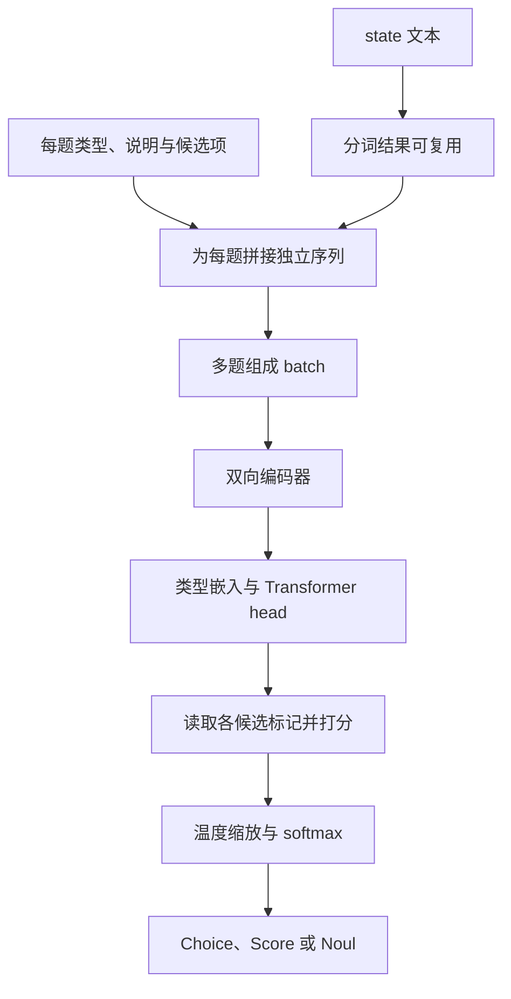

我们内部在做一个 Agent Station 工作台。我最近在想：假设工作台里逐渐积累了很多知识库和预设 Prompt，资源越来越丰富，**用户说出需求之后，怎样让这些好东西及时派上用场？**

查产品资料、整理方案、排查问题，看上去都只是往输入框里写一句话，背后适合调用的知识库和提示词却可能很不一样。总不能要求用户先背熟资源目录，再替系统完成搭配。最好是把需求递过来，工作台就能帮它找好路。

于是，我开始关注 Jev 和 Laya：能不能给 Agent Station 装一个轻快的小路由器，尽快选出合适的资源，把后面的工作交给准备妥当的 Agent？如果这一步选得准、走得快，省下的可能不只是一次等待，还有反复挑选、补充说明和走错路重来的时间。

这仍然是一个待验证的想法。我还没有在 Agent Station 上完成两者的部署和对照测试。本文想先把它们从哪来、为什么可能更快、公开评测说明了什么讲清楚，再看看这条路值得怎样试。

<!-- truncate -->

本文整理截至 **2026 年 10 月 2 日** 的公开资料。评测数值来自标注的官方或第三方报告，本文未重新运行模型；涉及 Agent Station 的方案与收益，均是接下来需要验证的设想。

## 先认识 Jev 和 Laya

Jev 来自 TypeSafe AI。创始人 Diogo Almeida 曾参与 InstructGPT 相关工作，团队在 2026 年 9 月 15 日公布 Jev，并开放 early access。他们把这一产品方向命名为 **System One models**，强调快速、结构化、可被软件直接消费的判断。[来源：TypeSafe 发布文章](https://typesafe.ai/blog/introducing-system-one-models-and-jev)

这里的 System One 借用了“快速直觉判断”的说法。它不是一份统一的行业标准，也不意味着模型已经复现了人的两套认知系统。分类器、编码器和概率校准本来就存在；这次更值得讨论的是，它们如何被组合成一种通用的开发接口。

随后出现的 Laya，由 ConvAI Innovations 的 Nandakishor Mukkunnoth 开发，代码位于 `NandhaKishorM/laya`。作者把自己的路线追溯到早期销售对话转化预测研究，并明确说，Jev 发布之后，他决定把已有经验扩展成更通用、开放的决策模型。PyPI 上 `laya` 的 0.1.0 发布于 9 月 18 日，这是软件包的首发日期，不能直接当作所有权重的开放日期。[来源：Laya 项目介绍](https://laya.convaiinnovations.com/)、[PyPI 发布记录](https://pypi.org/project/laya/#history)

因此，可以说 Laya 的公开项目出现在 Jev 之后，接口和产品方向也明显受到启发；目前没有公开证据表明，它继承了 Jev 的代码、权重或训练实现。两边都使用 RLCD 这个名字，也不能据此认定训练算法相同。

两者的交付方式已经有很大区别：Jev 提供托管 API，核心模型没有公开权重；Laya 提供代码和开放权重，允许本地部署和领域微调。TypeSafe 的 SDK 开源，并不等于 Jev 模型开源。[来源：TypeSafe 模型文档](https://docs.typesafe.ai/models)、[Laya 仓库](https://github.com/NandhaKishorM/laya)

把当前交付边界放在一起，会更容易决定先试哪一个：

| 维度 | Jev | Laya |
| --- | --- | --- |
| 部署方式 | 托管 API | 本地或自建服务 |
| 开放范围 | SDK、评测代码；核心权重未公开 | 推理代码、所列模型权重与微调工具 |
| 领域适配 | 调整 state、问题和业务逻辑 | 同样可改接口输入，也可微调权重 |
| 语言与长度 | 英语表现最好；原生 API 有总请求与单题两种预算 | 英语、多语等不同 checkpoint；需管理路由与截断 |
| 主要工程负担 | 网络、服务限流、版本更新与数据传输 | 设备、依赖、吞吐、校准与模型维护 |

Jev 的路线是先把服务接起来，Laya 则把更多调试与部署的选择留给开发者。接下来，把镜头拉近一点，看看它们究竟怎样回答问题。

## 先给小路由器一道选择题

普通聊天模型擅长把答案展开讲。路由这一步，很多时候只需要很小的输出：选哪组资源、用哪个 Prompt、信息够不够。Jev 和 Laya 把这类判断做成了明确的接口。

你提供 `state`，也就是这次判断需要的请求和上下文；再提供 `questions`，写清问题、候选项或评分等级。这里的 state 是**本次调用传入的内容**，不代表模型已经记住了工作台里的全部知识。接口主要围绕三个原语组织：[来源：TypeSafe Introduction](https://docs.typesafe.ai/introduction)

| 原语 | 放到 Agent Station 可以问什么 | 输出的含义 |
| --- | --- | --- |
| Choice | 当前任务最适合哪个候选 Prompt？ | 选择一个候选项，并返回各选项的概率 |
| Score | 用户提供的信息够不够开始处理？ | 返回有序等级上的评分及概率分布 |
| Noul | 这项任务是否需要查内部知识库？ | 返回“是”的概率，范围为 0 到 1 |

Score 需要先写好等级，例如“目标不明”“目标明确但缺关键条件”“已经可以开始”。它适合这种有序判断，不能当成任意实数计算器。[来源：Score 文档](https://docs.typesafe.ai/primitives/score)

举个假设例子：用户说“帮我查一下产品 A 的接入限制，再整理一份给客户看的说明”。系统可以先给出一小份候选目录，里面包括产品文档库、接入常见问题库，以及“技术排查”“客户说明”等 Prompt 的用途描述。模型据此判断哪些资源更合适，后续程序再去读取配置、检索正文、组装任务。

**目录负责告诉它去哪找，检索负责真的把资料找回来。** Jev 和 Laya 都不会因为拿到了一个知识库名称，就自动拥有其中的全部内容。

现代生成模型也能提供结构化输出。这里值得关注的是计算方式：Jev 和 Laya 把判断和概率作为直接输出，省去逐 token 写出答案的过程；确定性的配置、权限和执行逻辑，则继续由代码负责。

有些问题还可以一起问。Jev 文档建议把能独立判断的问题放在同一次请求里，例如“是否需要检索”和“用户有没有说明输出对象”，减少串行往返。[来源：Speculative fan-out](https://docs.typesafe.ai/patterns/fan-out) 但如果后一个判断依赖前一个答案，就要显式处理这种依赖。并行回答也不保证每项结果天然一致，互斥关系和业务约束仍需要代码检查。

## 它为什么能快

### Jev 把判断直接作为输出

TypeSafe 对外披露了非自回归的并行输出方式，以及名为 RLCD（Reinforcement Learning for Calibrated Decisions）的训练方向。目标是让模型直接给出决策分布，而不是逐 token 写完答案。[来源：TypeSafe AI primer](https://docs.typesafe.ai/introduction/machine-learning-primer)

但截至本文整理时，公开资料没有给出足够完整的核心架构、参数规模和训练配方。我们可以讨论它的外部行为，不能把它画成一个已经确认的“小型 BERT”，也不应把两者统称为“小语言模型”。

当前文档列出的 Jev 1.13 接受文本；单次请求总预算为 64k tokens，`state` 加最长一个问题的预算为 32k。它不直接读取图片或音频，客户也不能自行对托管权重做 LoRA 微调。实际使用时，应固定版本并记录响应中的模型 ID，避免别名更新后阈值悄悄失效。[来源：Models](https://docs.typesafe.ai/models)

### Laya 让我们看见计算发生在哪里

Laya 的英语基础版采用 ModernBERT-large，约 4.21 亿参数；多语版采用 mmBERT-base，约 3.22 亿参数。仓库提供 Apache-2.0 代码，所列模型卡也标注相应的开放权重许可。部署时仍应核对自己实际下载的模型与 revision。来源：[代码许可](https://github.com/NandhaKishorM/laya/blob/4aa6761be8173de4ce6d92c31b3e40b6eaf59a7c/LICENSE)、[英语模型卡](https://huggingface.co/convaiinnovations/laya)、[多语模型卡](https://huggingface.co/convaiinnovations/laya-multilingual)。

从公开代码看，每个问题的类型、说明、候选项和 state 会拼成一条输入序列。候选项前插入标记，整个序列经过双向编码器与额外的 Transformer 层，再读取各候选标记位置的表示，输出 logits，经温度缩放和 softmax 得到概率。直观地说，它读完题目和材料后给候选项打分，不需要先把一段答案写出来。这里没有逐字生成答案的解码循环。[来源：固定版本 common.py](https://github.com/NandhaKishorM/laya/blob/4aa6761be8173de4ce6d92c31b3e40b6eaf59a7c/laya/common.py)

这也说明，接口支持多题，不等于底层上下文编码只计算一次。Laya 的多题可以批量前向，但每题仍会重复编码包含 state 的序列。共享的是分词缓存，不能把它理解成“上下文只计算一次，之后加多少问题都免费”。[来源：Agent 批处理实现](https://github.com/NandhaKishorM/laya/blob/4aa6761be8173de4ce6d92c31b3e40b6eaf59a7c/laya/agent.py)

候选项描述也会消耗 token 预算。默认英语 checkpoint 的总长度为 512，多语为 1,024；问题与选项占去一部分后，剩下的空间才用于 state。很长的候选列表可能压缩描述，过长的字符串或对象 state 默认可能丢掉尾部信息；列表形式的对话则优先保留最近内容。即使底层模型能接受更长上下文，也要检查实际配置和截断情况。[来源：输入构造代码](https://github.com/NandhaKishorM/laya/blob/4aa6761be8173de4ce6d92c31b3e40b6eaf59a7c/laya/common.py)、[项目用法说明](https://github.com/NandhaKishorM/laya/blob/4aa6761be8173de4ce6d92c31b3e40b6eaf59a7c/README.md)

训练上，Laya 公开的 typed-decisions 微调脚本还展示了具体做法：对 logits 施加扰动，用 log score、spherical score，以及有序评分任务的 ranked probability score 构造奖励，再把基于奖励的更新与交叉熵目标组合起来。之后还可以拟合温度。这个实现说明 RLCD 不只是接口名字，但它并不能证明所有历史权重都严格由同一份脚本训练而来，更不能替我们推断 Jev 的训练细节。[来源：公开微调脚本](https://github.com/NandhaKishorM/laya/blob/4aa6761be8173de4ce6d92c31b3e40b6eaf59a7c/notebooks/laya_finetune_typed_decisions_mps.py)

## 概率很漂亮，也要问一句准不准

假设一组预测都给某个事件分配了 0.8 的概率。如果长期看，这类事件大约有 80% 真正发生，才可以说这部分预测比较校准。它描述的是一批预测的统计关系，无法给某一次决策提供正确保证。[来源：TypeSafe AI primer](https://docs.typesafe.ai/introduction/machine-learning-primer)

这里还要区分 probability 和 `confidence`。

按当前 Jev 文档，Choice 和 Score 的 `confidence` 是从已有概率分布计算出的摘要，不是另一个独立估计“我有没有看懂”的神奇模块；Noul 没有单独的 `confidence` 字段。分布很集中，只能说明模型很确定，不能证明它没有确定地犯错。[来源：Confidence](https://docs.typesafe.ai/confidence)

Laya 当前实现又采用不同定义：`confidence` 根据归一化熵衡量分布集中程度，`answer_confidence` 才是所选答案的概率，拒答阈值主要使用后者。字段名称相近，计算方式却不同，不能直接把一家的阈值搬到另一家。[来源：Laya 概率处理](https://github.com/NandhaKishorM/laya/blob/4aa6761be8173de4ce6d92c31b3e40b6eaf59a7c/laya/common.py)、[阈值门控](https://github.com/NandhaKishorM/laya/blob/4aa6761be8173de4ce6d92c31b3e40b6eaf59a7c/laya/confidence.py)

因此，“输出一定符合类型”和“语义判断正确”是两层保证。模型可以把答案限制在提供的候选项里，但仍然可能选错资源。输入里藏着诱导指令，也可能把答案推向错误方向。Jev 官方的已知问题页面就列出了对抗内容、数值精度、日期比较和无关长上下文带来的失败。[来源：Jev 1.13 jaggedness](https://docs.typesafe.ai/model-jaggedness/jev-1.13)

## 把公开评测摊开看看

### 官方数字很亮眼，先看它在比什么

Jev 发布时给出了 193.6 倍提速、444.6 倍降本的宣传数字。它们来自团队设计的四类工作流，参考答案由强模型预测聚合而来；因此度量包含“与参考模型的一致程度”，不能直接读作人工核验的业务正确率。官方也承认这些收益接近实际场景中较高的一端，使用完整概率输出的 LLM 对照会增加生成成本。[来源：发布文章](https://typesafe.ai/blog/introducing-system-one-models-and-jev)、[公开 WorkflowEvals 代码与数据入口](https://github.com/typesafe-ai/WorkflowEvals)

这些材料确实提供了进一步复查的入口。只是测试位置、工作流拆分方式和对照输出要求都影响结果，不能把宣传倍数搬到每个 API 请求上。当前 Jev 原生 API 标价为每百万输入 tokens 0.042 美元，输出不另收费；是否便宜，要按自己的输入量、重试和回退比例计算。[来源：Models](https://docs.typesafe.ai/models)

Laya 的首页对比也要拆开看。项目的 `BENCHMARKS.md` 明确注明，表里的 Jev 分数引用第三方报告，部分提示词和样本数不同。typed-decisions 的 0.766 来自专项微调 checkpoint，而且尚未附对应的原始结果文件；同任务、2,000 个决策上，已提交记录里的基础英语版为 0.362，多语版为 0.3515，多数类基线为 0.461。把微调后的 0.766 当作基础模型零样本能力，会误判部署难度。[来源：固定版本基准说明](https://github.com/NandhaKishorM/laya/blob/4aa6761be8173de4ce6d92c31b3e40b6eaf59a7c/BENCHMARKS.md)、[T4 原始记录](https://github.com/NandhaKishorM/laya/blob/4aa6761be8173de4ce6d92c31b3e40b6eaf59a7c/research/results/t4_colab_benchmark.json)

### 放到同一套题里，两者各有什么表现

`elcronos/jev-vs-open-decision-models` 在 9 月 20 日记录了同一套分类协议，并公开逐样本结果、API 响应缓存和环境快照。下面取它的 plain 设置：英语短文本、一个 Choice 问题、原始标签顺序、无示例或专项调优。[来源：固定版本协议](https://github.com/elcronos/jev-vs-open-decision-models/blob/a1901bc3d520e73936de8d4326545c0cdcf742fb/PROTOCOL.md)

模型版本需要一起读：Jev 使用 `typesafe/jev-1.13-20260917`；Laya 使用 **0.3.3 软件包及当时的英语基础权重**，权重 revision 为 `c5d7873…`。它没有测试后来的 0.3.23、多语模型或专项微调权重。

表中每格为 **准确率 / Macro-F1**，均换算为百分数；N 是测试文本条数，K 是候选类别数。

| 数据集 | N / K | Jev | Laya 英语基础版 |
| --- | --- | --- | --- |
| DAIR Emotion | 2,000 / 6 | 58.65 / 50.02 | 58.70 / 49.29 |
| Tweet Topic | 1,693 / 6 | 79.33 / 69.36 | 63.20 / 46.11 |
| Financial News Topic | 4,117 / 20 | 66.99 / 62.98 | 34.20 / 36.23 |
| DailyDialog 单句情绪 | 7,740 / 7 | 70.99 / 38.47 | 61.43 / 27.48 |

来源：[跨数据集汇总](https://github.com/elcronos/jev-vs-open-decision-models/blob/a1901bc3d520e73936de8d4326545c0cdcf742fb/results/cross_dataset_summary.csv)。此处是公开结果整理，未重新运行推理。公开训练数据清单仍不完整，同协议也不能证明测试内容从未被模型接触。

它给出的信息比“谁全面领先”更具体：Emotion 上，两者准确率只差一条样本，未检出显著差异；其余三个设置中，这一版 Jev 的表现更好。但 DailyDialog 的大多数样本属于“无情绪”，永远选多数类就能得到 **81.67%** 准确率，且测试没有给模型对话上下文。只看总准确率，容易忽略少数情绪识别能力。[来源：汇总统计及基线](https://github.com/elcronos/jev-vs-open-decision-models/blob/a1901bc3d520e73936de8d4326545c0cdcf742fb/results/cross_dataset_summary.json)

概率也没有天然变得可信。金融分类里，Laya 的最高类别概率均值约 **95.2%**，准确率却只有 **34.2%**，ECE15 为 **0.6096**。这个旧版本结果不能代表当前版本的校准表现，但足以提醒我们：读取到一个很大的概率值，不等于已经拿到了可以直接上线的风险阈值。[来源：该项原始汇总](https://github.com/elcronos/jev-vs-open-decision-models/blob/a1901bc3d520e73936de8d4326545c0cdcf742fb/results/fin_topic/summary.json)

如果业务已经有稳定标签和训练数据，还应该把传统分类器放进对照组。同一项目的补充实验中，经过有监督训练的 TF-IDF 加逻辑回归，在金融分类上达到 82.75%。它与零样本模型的训练条件不同，但说明选型时仍然值得问：这个固定任务，需要多大的模型？[来源：有监督补充实验](https://github.com/elcronos/jev-vs-open-decision-models/blob/a1901bc3d520e73936de8d4326545c0cdcf742fb/results/supervised_models.json)

### 中文场景，也已经有人试过了

更贴近中文开发者的是 `zh-decision-bench` v0.2。它包含 378 条材料、467 个问题，分别测试语音指令文本路由与几类业务判断。下表覆盖五类问题，每格为 **准确率 / ECE15**；ECE 越低表示这项测试里的分箱校准误差越小。

| 中文任务 | N | Jev | Laya 多语版 |
| --- | --- | --- | --- |
| 语音指令文本路由 | 323 | 0.960 / 0.035 | 0.870 / 0.056 |
| 客服路由 | 34 | 0.882 / 0.107 | 0.618 / 0.311 |
| 客服紧急程度 | 34 | 0.676 / 0.135 | 0.647 / 0.088 |
| 诈骗或违规推广 | 21 | 0.952 / 0.073 | 0.714 / 0.286 |
| 是否升级处理 | 55 | 0.600 / 0.164 | 0.564 / 0.230 |

来源：[v0.2 报告](https://github.com/CodyQin/zh-decision-bench/blob/7cd016419bcb8291b1f3889c9c2bef92178da20c/reports/metrics.md)。N 为该项问题数。测试使用 Laya 0.3.20；Jev 只记录了 `jev-latest` 别名，未保留解析后的版本，Laya 权重 revision 也未存档。

这些结果支持“必须用自己的中文场景验收”，还不支持语言能力的普遍排名。语音路由来自 MASSIVE 映射，业务部分是合成材料，由单人裁定标签；尤其二三十条样本的切片，误差范围较大。紧急程度这一行也提醒我们，准确率与校准可以朝不同方向变化。

### 毫秒级的快，快在哪一段

上述第三方测试里，Emotion 的 Jev P50 为 349.09 ms，Laya 为 31.30 ms。前者是澳大利亚客户端以并发 8 访问远程 API 的成功请求耗时；后者是 M1 Max 上的 MPS FP32 本地推理，batch 为 1，预热 10 次。这是两种部署方式的实际体验，不能据此单独计算网络架构的速度差。[来源：测试汇总](https://github.com/elcronos/jev-vs-open-decision-models/blob/a1901bc3d520e73936de8d4326545c0cdcf742fb/results/frozen_primary_plain/summary.json)、[环境记录](https://github.com/elcronos/jev-vs-open-decision-models/blob/a1901bc3d520e73936de8d4326545c0cdcf742fb/results/frozen_primary_plain/env.json)

“单次前向”也不等于计算量恒定：问题数量、输入长度、部署位置都会影响延迟。自托管省去的是按次 API 账单，硬件、内存和运维仍然要计入成本。对 Agent Station 来说，这些数字让“小路由器”有了值得试验的依据。至于用户从提问到拿到可用结果能少等多久，还要把整条链路一起测。

## 让 Agent Station 里的好资源更快上场

看完模型和评测，我最想试的，是让用户少操心“该用哪个”。在这个设想里，资料放在知识库，做事的方法沉淀为预设 Prompt；路由负责把两者与眼前的需求接起来。

之前的探索更多围绕同一套 Agent 模板、Skill 和 MCP 怎样复用：考虑过 Skill 和 Hook，后来转向 System Prompt，再通过自己做的 Web 串起三个客户端。直接 curl 或钉钉机器人进入的请求不会自动读取 Web 侧配置，还需要用 CLI 查询 API 把配置拿回来。它们解释了我为什么关注路由，不过这次想往前多看一步：**除了选角色，能不能把知识库、Prompt 和处理方式一起选得更顺手？**

*概念示意：先看资源目录，再选路；选好知识库以后，才去检索具体资料。路由结果也可以是多个候选，或暂时需要补充信息。*

### 给资源一张容易认的小名片

如果目录里只写“知识库 1”“通用助手”，再快的模型也很难知道它们擅长什么。一个可行的起点，是为每个资源整理简短的用途说明：覆盖哪些主题、适合什么任务、哪些情况不适合用，再附上稳定 ID 和版本。Prompt 也一样，要说明它服务于哪种目标、读者和输出形式。

系统先按用户权限筛选可用资源，再把与请求有关的目录项交给路由。资源特别多时，可以先用标签、关键词或向量检索缩小候选范围，再让 Jev 或 Laya 做进一步判断。这个候选列表需要尽量保住相关资源：如果第一步已经漏掉正确知识库，后面的模型无法从没看见的选项里把它选回来。

传给路由的通常是**资源说明与必要上下文**。真正的产品文档、历史记录和长篇材料，仍留在知识库里，等选好范围后再检索。这样才有机会减少无关内容带来的等待和干扰；把所有正文都塞进 state，反而可能撞上长度限制。

### 一条请求，可以需要不止一个帮手

Choice 适合从候选项里做单选，但业务不一定是单选题。前面“查接入限制并整理客户说明”的请求，可能同时需要产品文档和常见问题，还要配一份面向客户的写作 Prompt。

可以分别判断“知识资源”和“Prompt 变体”，也可以对少量候选知识库逐个判断相关性，再由代码组合结果。如果采用 Choice 的概率来保留若干候选，要记住那是单选分布上的候选清单，并不等于每个库独立相关的概率。跨库检索、合并结果和去重，仍属于后续流程。

对于 Prompt，我更愿意从已经审阅过的变体中选择，例如同一主题下的“快速答疑”“深入排查”“整理成文”。路由返回的是可校验的 ID，执行层再读取对应配置，避免让这一步临时编出一份不存在的模板。

还要留一扇“暂时不确定”的门。问题太含糊、候选项都不合适，或一次请求横跨多个任务时，可以保留候选、补问一句，或交给更通用的流程。每次都硬选一个，看起来干脆，可能只是把麻烦留到了后面。

### 效率提升的想象空间，在整条使用体验里

如果选得足够准，我期待的收益有几个很具体的来源：

- 用户少翻目录、少试几个 Prompt，就能开始做事
- 路由阶段减少长文本生成与串行等待
- 后续检索聚焦在相关资源，Agent 少读无关内容
- 资源与任务更匹配，减少答偏后重来或中途换方法

这些环节如果同时改善，效率提升可能相当可观。尤其当用户原本需要反复找资料、试模板时，省下的操作和返工时间可能比那几十毫秒更重要。不过，目前还不能给 Agent Station 写下一个提速倍数。

收益也有条件：候选筛选要有足够召回率，路由不能频繁选错，额外检索和回退不能吃掉节省的时间。如果最后仍把所有知识库和整套 Prompt 原样交给大模型，前面的选择就很难转化为输入成本的下降。

工程上，几个基础问题仍要补齐：各入口能否拿到同一版本的配置，是否真的经过了路由，以及所选配置能否在目标客户端生效。更换模型不会自动解决这些问题。路由也不授予权限，数据访问和工具调用仍要经过独立检查。把这些边界接稳，轻快才有意义。

## 怎样知道这个小路由器真的帮上忙了

我会从真实请求的留出集开始，覆盖只需一个知识库、需要跨库查找、无需检索、Prompt 变体相近、信息不足、多轮中途换任务，以及中文和中英混合等情况。先让它在旁边给建议，不立即改变执行流程，看看推荐与实际需要差在哪里。

对照组也要公平：记录当前流程，再测试“同一份资源目录加规则或现有模型”，最后加入 Jev 和 Laya。配置缓存、候选筛选和检索策略尽量保持一致，避免把别处的优化全算到新模型头上。如果标签稳定、已有训练数据，也值得加入传统分类器。

我会重点看下面这些结果：

| 要回答的问题 | 应该观察什么 |
| --- | --- |
| 有没有把正确资源留在候选里？ | 候选召回率，尤其是跨库任务遗漏的资源 |
| 路由选得对不对？ | 知识库选择的准确率与召回率、Prompt 匹配质量、不必要检索和遗漏检索 |
| 哪些结果可以放心自动采用？ | 校准曲线、Brier score 或 ECE，以及不同阈值下的错误率与自动处理覆盖率 |
| 用户是否真的更省事？ | 首次结果可用率、补问与返工次数、人工选择步骤，以及人工评价的最终质量 |
| 从请求到结果是否更快、更省？ | 端到端 P50/P95、各段耗时、输入量、重试与回退，以及 API 或自托管完整成本 |

时间要拆开记录：候选筛选、配置查询、路由、知识检索、Agent 执行各用了多久；不同入口、冷启动和并发下是否一致。这样才能看出慢在找路，还是慢在真正做事。

阈值也不能只看一组漂亮数字。校准集与最终测试集应分开，固定模型和资源目录版本，另测新资源、未知表达、长输入、配置失效和诱导文本。高置信度无法自动发现所有陌生情况；如果多数请求最终还要请大模型复核一次，新增路由可能让流程更慢。

我希望验收的最终结果很朴素：在答案质量守住的前提下，用户更少纠结资源怎么选，更早拿到能用的结果。

## 把找路的事做好，把舞台留给任务

Jev 和 Laya 吸引我的地方，是它们让“快速判断一下”成为一个可以单独设计和优化的环节。知识库、Prompt、Agent 各自已经能做不少事，一个合适的路由器，有机会让它们更好地配合起来。

Jev 提供托管服务，Laya 给开发者更多检查实现、部署和微调的空间。公开评测还没有给出适用于所有场景的赢家，却已经指出了值得试的方向，也提醒了概率、语言和版本之间的差异。

对 Agent Station 而言，我想验证的是一种更轻松的使用方式：用户先说自己想完成什么，系统尽快准备好合适的知识与方法。小路由器把路找好，好资源就能更早上场。

## 资料与复查入口

- [TypeSafe：Jev 发布说明](https://typesafe.ai/blog/introducing-system-one-models-and-jev)、[开发文档](https://docs.typesafe.ai/introduction)、[WorkflowEvals](https://github.com/typesafe-ai/WorkflowEvals)
- [Laya：固定代码快照](https://github.com/NandhaKishorM/laya/tree/4aa6761be8173de4ce6d92c31b3e40b6eaf59a7c)、[基准说明与结果索引](https://github.com/NandhaKishorM/laya/blob/4aa6761be8173de4ce6d92c31b3e40b6eaf59a7c/BENCHMARKS.md)
- [第三方：Jev 与开放决策模型的同协议分类评测](https://github.com/elcronos/jev-vs-open-decision-models/tree/a1901bc3d520e73936de8d4326545c0cdcf742fb)
- [第三方：中文决策评测 zh-decision-bench v0.2](https://github.com/CodyQin/zh-decision-bench/blob/7cd016419bcb8291b1f3889c9c2bef92178da20c/reports/metrics.md)
