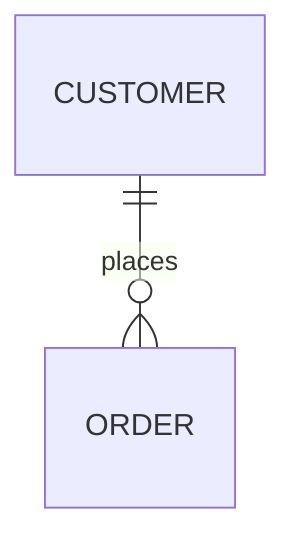

Docusaurus 从 3.6.2 升级至 3.9.2，带来显著的性能提升和新特性支持。

> 构建速度提升 3.8 倍，热重建提升 2 倍！

---

<!-- truncate -->

## 🚀 0.6.0 版本：Docusaurus 3.9 性能大升级

### 核心升级

**Docusaurus:** `3.6.2` → `3.9.2`

本次升级适配了 Docusaurus 3.7、3.8、3.9 三个版本的新特性，重点引入 **Docusaurus Faster** 性能优化套件，带来显著的构建速度提升。

---

### 📊 性能提升对比

基于 React Native 官网（~2000 页）的基准测试数据：

| 构建类型 | 3.6.2 | 3.9.2 + Faster | 提升倍数 |
|----------|-------|----------------|----------|
| 冷启动构建 | ~120s | ~31s | **3.8x** 🔥 |
| 热重建 | ~33s | ~17s | **2x** 🔥 |
| SSG 生成 | - | - | **~2x** 🔥 |

对于本站这种规模的站点，构建时间从原来的 1-2 分钟缩短到 20-30 秒，开发体验大幅提升。

---

### ✨ 新特性与优化

#### 1. Docusaurus Faster 性能套件

启用了三项核心优化：

```typescript
future: {
  experimental_faster: {
    rspackBundler: true,           // Rspack 替代 Webpack
    rspackPersistentCache: true,   // 持久缓存
    ssgWorkerThreads: true,        // Worker Threads 并行 SSG
  },
}
```

**技术细节：**

- **Rspack Bundler**: 基于 Rust 的构建工具，由字节团队开发，构建速度远超 Webpack
- **Persistent Cache**: 持久化构建缓存，重复构建时直接复用，避免重复工作
- **Worker Threads**: 利用多核 CPU 并行生成静态页面，SSG 速度翻倍

**注意事项：**
- 持久缓存需要保留 `./node_modules/.cache` 目录
- Vercel/Netlify 等 CDN 自动保留缓存，无需额外配置
- 首次构建会慢一些（建立缓存），后续构建非常快

---

#### 2. Node.js 版本升级

**要求：** `>=18.0` → `>=20.0`

**原因：**
- Node.js 18 已于 2025 年 EOL，不再接收安全更新
- Docusaurus 3.9 依赖的 `webpack-dev-server@4` 存在安全警告
- Rspack 1.5+ 要求 Node.js >=18.12

**影响：** 确保所有开发/生产环境使用 Node.js >=20.0

---

#### 3. React 19 支持

Docusaurus 3.7 开始支持 React 19，本站已提前升级：

```json
"react": "^19.0.0",
"react-dom": "^19.0.0"
```

**说明：**
- React 19 是 Docusaurus v4 的最低要求
- 提前升级确保未来平滑过渡到 v4
- 目前已同时支持 React 18 和 19

---

#### 4. Algolia DocSearch v4

已升级至 DocSearch v4.6.0，带来更好的搜索体验。

**新特性：**
- **AskAI**: AI 驱动的搜索助手，支持对话式搜索
- 改进的搜索相关性算法
- 更好的 UI/UX

**可选配置：** 如需启用 AskAI，可在 Algolia 配置中添加：

```typescript
algolia: {
  appId: 'QXN8S92SP4',
  apiKey: '***',
  indexName: 'eaveluo',
  askAi: {
    assistantId: 'your-assistant-id', // 在 docsearch.algolia.com 创建
  },
}
```

---

#### 5. SVGR 插件配置

Docusaurus 3.7 将 SVGR 从内置功能提取为独立插件，支持自定义 SVG 优化配置：

```typescript
presets: [
  [
    'classic',
    {
      svgr: {
        svgrConfig: {
          svgoConfig: {
            // 自定义 SVG 优化配置
          },
        },
      },
    },
  ],
],
```

---

### 🎁 其他改进

#### 博客功能增强（3.7）
- 新增博客作者社交媒体图标支持：Bluesky、Mastodon、Threads、Twitch、YouTube、Instagram
- Front Matter 支持 `sidebar_label` 自定义侧边栏标签
- npm2yarn 插件支持 Bun 包管理器

#### CSS Cascade Layers（3.8）
- 已启用 v4 Future Flag 提前适配
- 自定义 CSS 优先级更高，减少样式冲突

#### Mermaid ELK 布局（3.9）
支持更复杂的图表布局：

````markdown

````

#### i18n 优化（3.9）
- 支持自定义每个 locale 的 URL 和 baseUrl
- 优化非 i18n 站点的构建速度

---

### ⚠️ 注意事项

1. **缓存目录**: 确保 CI/CD 保留 `node_modules/.cache`（Vercel 自动处理）
2. **Node.js 版本**: 确保所有环境使用 Node.js >=20.0
3. **依赖兼容性**: 自定义插件需兼容 React 19

---

### 📈 后续优化计划

#### 可选：禁用 concatenateModules
对于大型站点，禁用此优化可进一步提升构建速度：

```typescript
future: {
  experimental_faster: {
    rspack: {
      optimization: {
        concatenateModules: false,
      },
    },
  },
},
```

**权衡：** JS 包体积增加 ~3%，构建速度提升显著（有站点实测 4x 冷启动、16x 热重建）。

#### 可选：启用 AskAI
如需 AI 搜索助手功能，可在 Algolia 官网创建助手并配置。

---

## 📝 0.7.0 计划

### 系统方面
- [ ] 增加 PWA 功能
- [ ] 优化移动端体验
- [ ] 探索更多性能优化空间

### 内容方面
最近在探索 RN 兼容鸿蒙的问题，以及家用服务器的部署方案，遇到有趣的东西会不定期发文！

---

## 🔗 参考链接

- [Docusaurus 3.7 发布博客](https://docusaurus.io/blog/releases/3.7)
- [Docusaurus 3.8 发布博客](https://docusaurus.io/blog/releases/3.8)
- [Docusaurus 3.9 发布博客](https://docusaurus.io/blog/releases/3.9)
- [Docusaurus Faster](https://github.com/facebook/docusaurus/issues/10556)

---

*发布于 2026-02-26 | 最后更新 2026-02-26*
