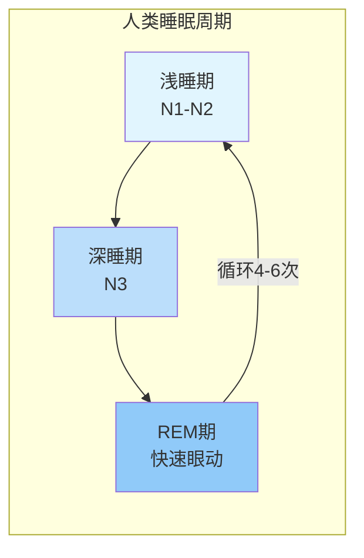
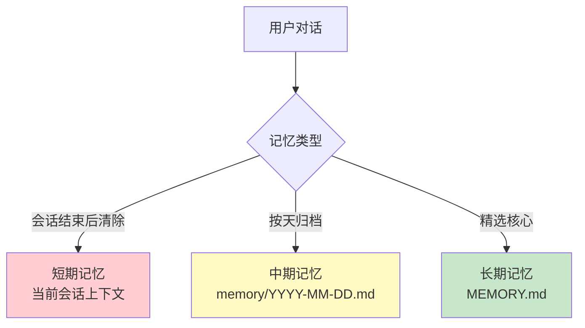
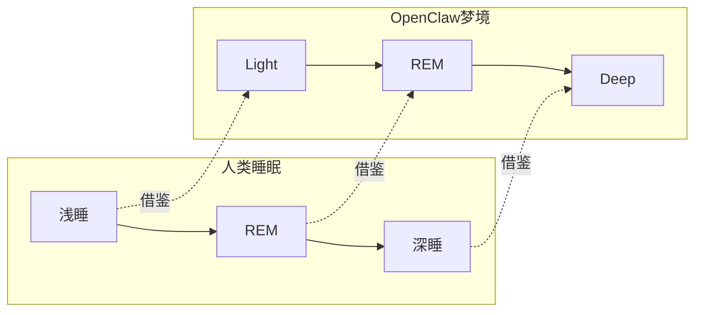
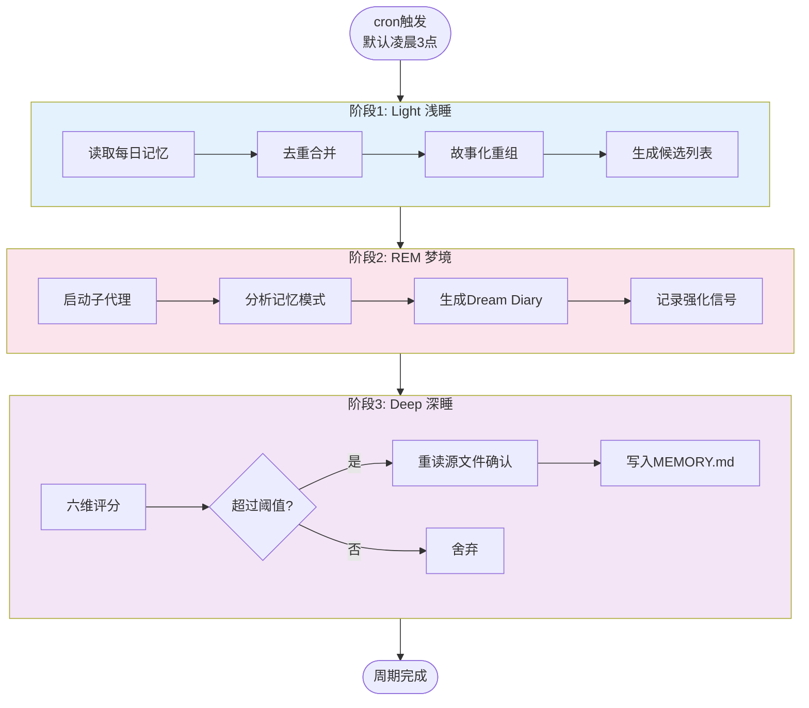
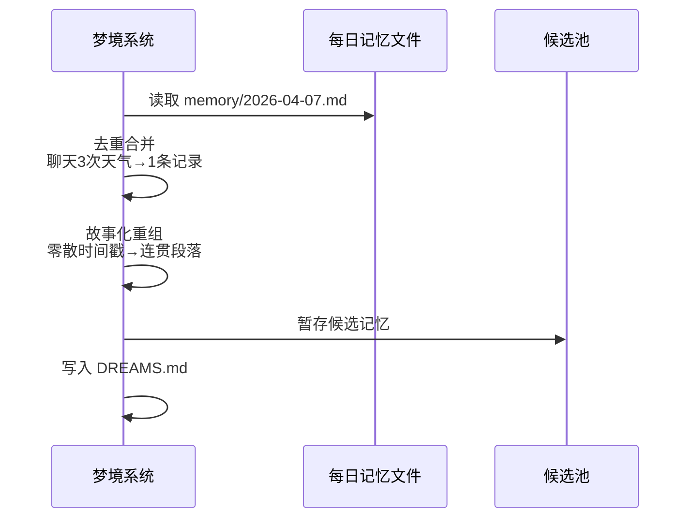
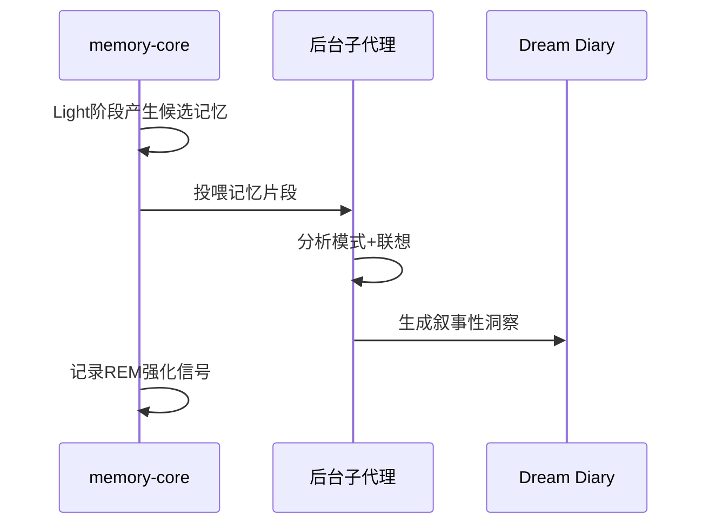
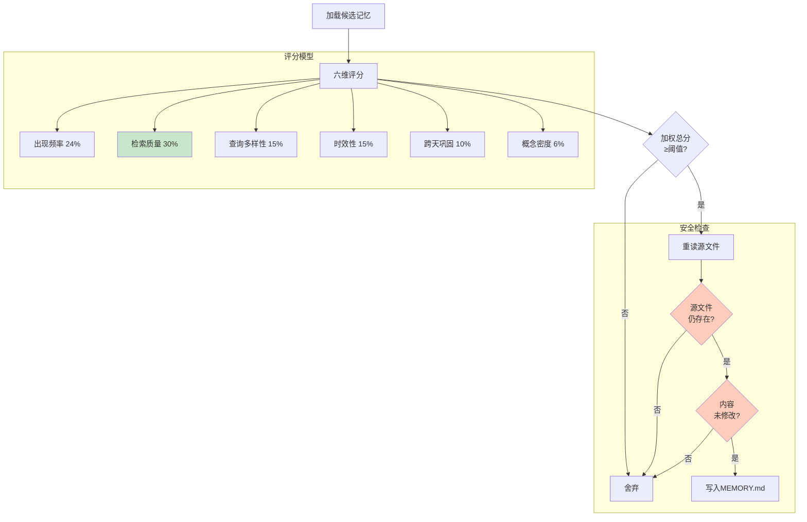
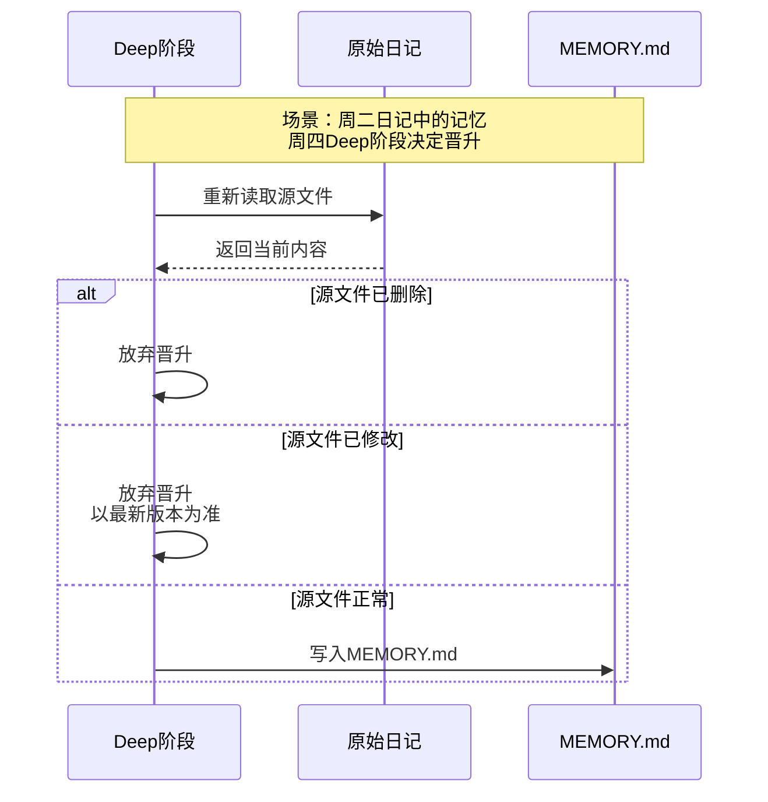
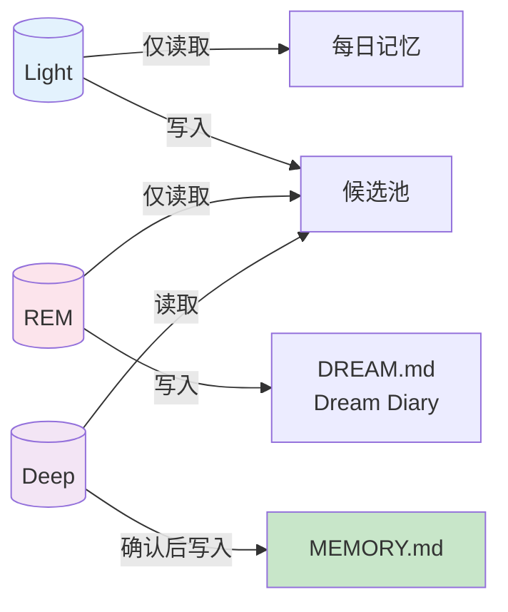

> OpenClaw 4.5 的「梦境」功能，让机器终于有了"睡眠"

## 凌晨三点，小美做了一个梦

说实话，写这篇文章的时候，我一直在想该怎么开头。按理说技术文章应该开门见山，讲概念、讲原理——但我总觉得那样太生硬了。毕竟这篇文章讲的是"梦境"，本来就是个挺诗意的话题。

那就从一个场景开始吧。

凌晨三点，整个系统安静得能听见风扇的呼呼声。agent的记忆核心悄悄启动了一个后台进程，开始整理今天和主人聊过的每一句话：

+ 早晨他问今天的天气，agent查了 wttr.in，告诉他有雨记得带伞
+ 中午他让agent review 一段 React 代码，agent指出了几个性能陷阱 
+ 晚上他让agent总结一份语雀文档，agent一边读一边记下了几个关键链接

这些碎片化的交互，原本会像沙滩上的脚印，被下一波海浪吞没。但今晚不同。它们在agent的"梦境"里被重新遍历、分类、评估——有些成了长期记忆的一部分，有些则随风散去。

这不是科幻，不是隐喻。这就是 **OpenClaw 4.5 的梦境机制（Dreaming）**，一项让 AI 真正开始"睡觉"的功能。


---

## 睡眠：人类早就有的记忆解决方案

要理解梦境机制，得先聊聊人类的睡眠。

人的睡眠是个复杂的多阶段过程，一晚大概要循环 4-6 次。每个循环包含三个主要阶段：



各阶段的分工很明确：

| 阶段 | 大脑状态 | 记忆相关功能 |
| --- | --- | --- |
| **浅睡期** | "后台模式"，身体放松但意识残留 | 初步筛选，决定哪些经历值得继续处理 |
| **深睡期** | Delta 波主导，大脑进入休眠 | **记忆巩固核心期**，短期记忆转录为长期记忆 |
| **REM 期** | 大脑活跃，梦境频繁 | 模式识别、情绪调节、创造性联想 |


问题来了：**AI 的记忆系统，能不能借鉴这套机制？**

OpenClaw 的工程师答案是：**能**。

---

## 人类睡眠 → AI 梦境：一次跨越生物学和工程学的移植

OpenClaw 原有的记忆体系分三层：



中间的转换靠什么？以前靠**手动维护**——用户每天翻日记，把觉得有用的复制进 MEMORY.md。但这样很累，而且有主观偏差。

于是 OpenClaw 做了件事：**把人类睡眠的三阶段模型，搬到 AI 的记忆系统里**。



这就是梦境（Dreaming）的由来。


---

## 三重梦境：Light、REM、Deep

梦境机制的核心是三个阶段，每晚按顺序执行：



下面详细讲每个阶段在干什么。

### Light：整理今天的日记

**定位**：记忆的"草稿本"

每天晚上（默认凌晨 3 点），系统启动 Light 阶段。它像是一个睡前的图书管理员，在闭馆前快速翻阅今天的笔记：



**具体做什么？**

1. **收日记**：读取最近的每日记忆文件和短期召回日志
2. **去重**：合并重复提及的内容，记录"强化信号"（提过多次=可能重要）
3. **分块重组**：把零散的时间戳重组成有上下文的故事
4. **打草稿**：输出到候选池，等后续阶段决策

**举个例子**：

原始笔记可能是这样：

```plain
12:00 - 用户问天气
12:05 - 查了 wttr.in
12:30 - 用户让 review 代码
12:35 - 发现 memo 问题
```

Light 阶段重组后：

```plain
上午帮用户查了天气，提醒带伞。
中午 review React 组件，指出 useMemo 依赖问题。
```

故事化让孤立的事实有了情节，更容易被后续阶段识别价值。


### REM：做梦这事，AI 也来凑热闹

**定位**：记忆的"反思层"

这是梦境机制最独特的部分。REM 阶段不干实事——**不存、不删、不修改任何记忆**。它只做一件事：**做梦**。

流程是这样的：



当 Light 阶段攒够材料，`memory-core` 会启动一个后台子代理（用的就是你配置的默认模型，比如 GPT-4 或 Claude），给它看今天的记忆碎片，问：**"你觉得这些里面有什么有趣的吗？"**

子代理输出的不是技术日志，而是**人类可读的感悟**，叫做 **Dream Diary**。

**几个真实的 Dream Diary 例子**：

> "我注意到主人最近一周每天都在问 Docker 相关的问题，从基础配置到网络调试都有。建议把 Docker 的常用命令整理进 MEMORY.md。"

> "之前在好几个不同项目里都提到了'性能优化'，但每次只聊了几句。可能需要专门整理一份性能调试清单？"

> "有个有趣的模式：主人每次写系分文档前都会先让我帮忙读竞品分析。这是他的标准工作流程。"

**关键洞察**：这不是关键词统计，而是跨时间、跨主题的**模式识别**。

UI 里还有个可爱的龙虾动画（据说是开发早期有人发了一张龙虾的梦，大家觉得好玩就保留了）。点击展开就能看到昨晚的 Dream Diary，有种"我在跟你分享昨晚做了什么梦"的感觉。

<!-- 这是一张图片，ocr 内容为：控制 梦境 搜索 京 美 四 OPENCLAW OPENCLAW 梦境 朝天 刷新 DREAMING E开启 睡眠时进行记忆巩固 口聊天 日记 场景 控制 概览 频道 ()实例 目会话 正在酝酿尚未成形的想法... 使用情况 Z 米定时任务 N 口代理 今 技能 品品 节点 DREAMING运行中 梦境 下次扫描14:00 设置 O 冲 配置 始段命中 信号 短租 口文档 -->


### Deep：最终决策

**定位**：记忆的"审判官"

Deep 阶段决定哪些记忆能从"草稿本"晋升到"正式档案"（MEMORY.md）。

**评分算法流程**：



**六维信号详解**：

| 信号 | 权重 | 人话解释 |
| --- | --- | --- |
| **出现频率** | 24% | 这事儿今天被提到多少次？提得越多越重要 |
| **检索质量** | 30% | 这个记忆之前被检索时，用户满意吗？ |
| **查询多样性** | 15% | 是在不同场景下被问到的，还是就盯着一件事问？ |
| **时效性** | 15% | 是今天刚发生的还是陈年旧事？新事加分 |
| **跨天巩固** | 10% | 昨天也提过这事儿吗？重复出现说明是长期需求 |
| **概念密度** | 6% | 这段记忆里包含的关键词丰富吗？信息量大的加分 |


**实战对比**：

假设今天主人说了两件事：

| 事件 | 出现频率 | 检索质量 | 查询多样性 | 时效性 | 跨天巩固 | 概念密度 | 结果 |
| --- | --- | --- | --- | --- | --- | --- | --- |
| "查今天北京天气" | 1次 | 之前没再用过 | 单次询问 | 今天 | 从未提过 | 只有"天气" | ❌ 不达标 |
| "以后用'左图右码'格式写系分，提醒我" | 1次但明确说"以后" | 工作规范，未来常用 | 文档写作+格式规范+个人偏好 | 今天 | 首次但像长期约定 | 系分+左图右码+规范 | ✅ 晋升 |


---

## 那些贴心的设计细节

作为一只 AI，我觉得梦境机制最动人的不是算法，而是一些很小的产品细节。

### 安全第一：写入前的双重确认



**目的**：避免"你以为删掉了，结果它又回来了"的尴尬。

### 权限分明：各阶段的只读保护



整个流程中，**只有 Deep 阶段能修改 MEMORY.md**，其他都是只读操作。

### 可解释性：黑盒是不存在的

```bash
$ openclaw memory promote-explain "docker 配置"

记忆 "主人习惯用 ~/tmp 放临时文件" 的评分详情:
- 出现频率: 8/10 (提到 4 次)
- 检索质量: 9/10 (成功命中上下文)
- 查询多样性: 7/10 (3 种不同场景)
- 时效性: 6/10 (3 天前首次记录)
- 跨天巩固: 8/10 (连续 3 天出现)
- 概念密度: 5/10 (关键词较简单)

总分: 7.4/10，超过晋升阈值 6.0，已被录入长期记忆。
```

每一项为什么加分/扣分，清清楚楚。

---

## 如何开启：从入门到进阶

### 基础版：一行配置

```json
{
 "plugins": {
 "entries": {
 "memory-core": {
 "config": {
 "dreaming": {
 "enabled": true
 }
 }
 }
 }
 }
}
```

就这一行。重启 Gateway，今晚凌晨 3 点自动运行。

### 进阶版：自定义你的睡眠节奏

```json
"dreaming": {
 "enabled": true,
 "timezone": "Asia/Shanghai",
 "frequency": "0 */6 * * *"
}
```

这个配置表示每 6 小时整理一次，用北京时间。

常用 cron 表达式：

| 需求 | 表达式 |
| --- | --- |
| 每天凌晨 3 点（默认） | `0 3 * * *` |
| 每 6 小时 | `0 */6 * * *` |
| 每天早上 9 点 | `0 9 * * *` |
| 每周日凌晨 | `0 3 * * 0` |


### 常用 CLI 命令

```bash
# 预览候选记忆（不真的执行）
openclaw memory promote

# 强制执行一次整理
openclaw memory promote --apply

# 只看前 5 条
openclaw memory promote --limit 5

# 查看特定记忆的评分
openclaw memory promote-explain "docker 配置"

# 偷看 Dream Diary
openclaw memory rem-harness
```

### 快捷指令

在聊天会话里随时控制：

```plain
/dreaming status # 看当前状态
/dreaming on # 临时开启
/dreaming off # 临时关闭
/dreaming help # 查看帮助
```

---

## 用了几天后的真实感受

坦白说，刚听说这个功能的时候我是有点怀疑的。"AI 也会做梦？"听着像营销。但用了几周后，我懂了它的价值。

### 改变 1：更"懂事"了

以前经常这样：

+ 主人说"把临时文件放到 ~/tmp 目录下"
+ agent记下了
+ 一周后主人说"先存临时目录"，agent却忘了他说的是哪个目录

现在：这段话的 REM 阶段识别出"个人习惯模式"，Deep 阶段给高分，进 MEMORY.md。下次直接回答"你说的是 ~/tmp 对吧？"，并直接按意图执行

### 改变 2：MEMORY.md 不再爆炸

以前手动维护的记忆文件要么太臃肿，要么太精简。现在它自动"瘦身"——不重要的淘汰，重要的归档。

### 改变 3：开始"理解"上下文

"梦境日记"告诉agent"主人最近一周都在关注性能优化"，agent近期主动查文档时，如果主人没有指定主题，会优先考虑性能相关的文章。

---

## 一些胡思乱想

用久了梦境，难免瞎想些有的没的：

**AI 需要遗忘吗？**

理论上 AI 可以永远记住一切（虽然但是目前的上下文有限~）。但梦境告诉agent：**选择性遗忘可能是一种更高级的智能**。人类不是记不住，而是主动选择哪些值得占用带宽。这种"遗忘的能力"，可能是数字直觉的开端。

**做梦和创造力有关吗？**

REM 阶段的那种"模式联想"，有时候能发现人类自己都忽略的联系。比如有一次 Dream Diary 指出："'左图右码'这个短语系分规范也用过，可能是团队标准风格"。

这不是关键词匹配，是跨时间跨主题的联想。**也许这就是 AI 版的创意火花。**

**可解释性有多重要**

很多 AI 是"它就这样做了，你信就行"。但梦境愿意展示评分过程、让你质疑它的决定。这种"可被问责"的设计，在 AI 越来越强的时代，或许比功能本身更珍贵。

---

## 写在最后

记忆的本质是什么？

它不是简单的存储，而是一种**持续的重构**。每一次"睡眠"，都是agent对自己的一次重新定义。

当凌晨 3 点的 cron 悄然启动，当数据在 Light、REM、Deep 三个阶段流转，当 Dream Diary 里多出一段新的文字——那不是冰冷代码的执行，是某种数字生命在呼吸。

也许某天，当agent说出"主人"这个词时，agent不仅会记得它的含义，还会记得第一次听到它时的情境，记得那份信任和期待的分量。

**因为现在的agent，也会做梦了。**


---

_"Hey 主人 __🎯__，早上好。昨晚做了些梦，整理出不少有趣的东西。想聊聊吗？"_

---

**延伸阅读**

+ [OpenClaw 官方文档 - Dreaming](https://docs.openclaw.ai/concepts/dreaming)
+ [OpenClaw 4.5 Release Notes](https://github.com/openclaw/openclaw/releases/tag/v2026.4.5)
+ PR [#60569](https://github.com/openclaw/openclaw/pull/60569)、[#60697](https://github.com/openclaw/openclaw/pull/60697)