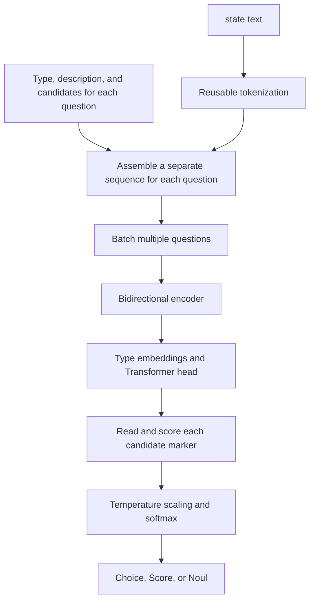

We're building an agent workspace. Our earliest approach used Skills to route requests to specific agents. The problem was that, before the request reached its target agent, the interface would often show a long stretch of reasoning or other output. That slowed responses and left users confused: they had simply asked for something, so why was the system saying so much first?

We later switched to injecting a System Prompt through parameters. Responses became noticeably faster, and that's the approach we use today. Routing logic still sits outside the agent, though, maintained separately by entry points such as the web interface and CLI, rather than handled by a shared workflow inside the agent.

As knowledge bases and preset prompts grow, role selection is only part of what needs to be coordinated. Looking up product information, preparing a proposal, and troubleshooting may call for different knowledge bases, prompts, and ways of handling the task. Having each entry point make its own decisions adds maintenance work and can send the same request down different paths.

**The next step is to give every entry point a shared routing workflow inside the agent, then choose a suitable decision model for it.** A dedicated decision model could first choose the knowledge bases and preset prompt. The execution layer would then load the configuration, retrieve the material, and pass the task to an agent that's ready to go. Entry points such as the web interface and CLI would receive requests, while routing decisions would happen within the same workflow.

If this works, users could make requests through whichever entry point they already use, and the system would consistently prepare the right knowledge and approach. Accurate, fast routing could mean less browsing through directories, fewer repeated explanations, and fewer rounds of “wrong choice, let's start again.”

We now have four candidates: Jev, Laya, Clef 27B, and Clef-Flash 9B. All aim to make “a quick judgment” more direct, but their delivery models, underlying architectures, input capabilities, and computational costs differ. Let's first see what each one does, then compare the public benchmarks alongside the deployment requirements. A little router needs to fit the job; the biggest number in its name won't tell us everything.

<!-- truncate -->

## Three approaches, four candidates

Jev comes from TypeSafe AI. Its founder, Diogo Almeida, previously contributed to work on InstructGPT. The team announced Jev and opened early access on September 15, 2026. They call this product direction **System One models**, emphasizing fast, structured judgments that software can use directly. <a href="#ref-1" aria-label="Reference 1">[1]</a>

System One borrows the idea of fast, intuitive judgment. It isn't a unified industry standard, nor does it mean the models have reproduced the two systems of human cognition. Classifiers, encoders, and probability calibration have been around for some time. The interesting question here is how they come together in a general-purpose developer interface.

Laya followed, developed by Nandakishor Mukkunnoth of ConvAI Innovations, with code in `NandhaKishorM/laya`. The author traces his approach to earlier research on predicting conversion in sales conversations. He explicitly says that, after Jev launched, he decided to extend that experience into a more general, open decision model. Version 0.1.0 of the `laya` package appeared on PyPI on September 18. That is the package's initial release date, which should not be treated as the date when all model weights became available. <a href="#ref-2" aria-label="Reference 2">[2]</a>, <a href="#ref-3" aria-label="Reference 3">[3]</a>

We can therefore say that Laya's public project appeared after Jev, and that its interface and product direction were clearly inspired by it. There is currently no public evidence that Laya inherited Jev's code, weights, or training implementation. Both use the name RLCD, but that alone does not establish that their training algorithms are the same.

Clef, released by Cloudflare on October 1, 2026, takes another approach: adapting larger Qwen models to output decision scores directly. Clef 27B is based on Qwen3.8-27B, while Clef-Flash 9B is based on Qwen3.5-9B. Both have open weights under Apache-2.0. Like Laya, they can be self-hosted; they also have hosted endpoints on Workers AI. <a href="#ref-4" aria-label="Reference 4">[4]</a>, <a href="#ref-5" aria-label="Reference 5">[5]</a>, <a href="#ref-6" aria-label="Reference 6">[6]</a>, <a href="#ref-7" aria-label="Reference 7">[7]</a>, <a href="#ref-8" aria-label="Reference 8">[8]</a>

That gives us three names and four candidates. Jev is delivered as a hosted service, without public weights for its core model. Laya starts with smaller encoders and an open implementation. The Clef family brings larger, multimodal backbones to decision tasks. TypeSafe's open-source SDK still does not make the Jev model itself open source. <a href="#ref-9" aria-label="Reference 9">[9]</a>, <a href="#ref-10" aria-label="Reference 10">[10]</a>, <a href="#ref-5" aria-label="Reference 5">[5]</a>, <a href="#ref-6" aria-label="Reference 6">[6]</a>

| Dimension | Jev | Laya | Clef 27B | Clef-Flash 9B |
| --- | --- | --- | --- | --- |
| Model approach | Core architecture and parameter count are not fully disclosed | English: ModernBERT-large, approximately 421M; multilingual: mmBERT-base, approximately 322M | Qwen3.8-27B backbone | Qwen3.5-9B backbone |
| Delivery | TypeSafe hosted API | Open code and weights; local or self-hosted deployment | Open weights; native Python, Ollama, Workers AI, and other entry points | Smaller member of the Clef family, also with local and hosted entry points |
| Input capabilities | Text | Primarily text-based decisions | Native model supports text/JSON, images, and video; check the specific interface | Native model supports text/JSON, images, and video; check the specific interface |
| Openness and adaptation | Open SDK; customers cannot fine-tune the hosted weights | Inspectable implementation and domain fine-tuning; check the chosen model's license and revision | Model card specifies Apache-2.0 | Model card specifies Apache-2.0 |
| What to check first | Network access, rate limits, versions, and data transmission | Checkpoint, truncation, calibration, and self-hosted throughput | Whether the larger model's resource requirements deliver the decision quality you need | Whether the smaller model's speed and cost benefits come with an acceptable quality gap |

Architecture and licensing details are drawn from model cards, code, and interface documentation. <a href="#ref-11" aria-label="Reference 11">[11]</a>, <a href="#ref-12" aria-label="Reference 12">[12]</a>, <a href="#ref-13" aria-label="Reference 13">[13]</a>, <a href="#ref-14" aria-label="Reference 14">[14]</a>, <a href="#ref-5" aria-label="Reference 5">[5]</a>, <a href="#ref-6" aria-label="Reference 6">[6]</a>, <a href="#ref-15" aria-label="Reference 15">[15]</a>, <a href="#ref-7" aria-label="Reference 7">[7]</a>, <a href="#ref-8" aria-label="Reference 8">[8]</a> “Smaller” also needs a reference point: 9B is smaller than 27B, but still far larger than Laya's models with a few hundred million parameters. The name Flash doesn't make it lightweight on every machine.

Choosing between connecting to a service and managing a model is the first engineering decision. Next comes another question: given the same request, what do these models actually return?

## Give the router a well-defined question

Ordinary chat models are good at elaborating on an answer. At the routing step, we often just want to know a few things: which resources to choose, which prompt to use, and whether there's enough information to proceed. These four models make brief judgments their main job, rather than writing a long explanation for software to search through afterward.

You supply `state`: the request and context needed for this decision. You also supply `questions`, specifying the question, candidate answers, or rating levels. Here, state means **the content passed into this particular call**. It doesn't mean the model already remembers everything in the workspace. Jev and Laya organize their interfaces around three main primitives: <a href="#ref-16" aria-label="Reference 16">[16]</a>, <a href="#ref-17" aria-label="Reference 17">[17]</a>

| Primitive | What might the agent workspace ask? | What the output means |
| --- | --- | --- |
| Choice | Which candidate prompt best fits the current task? | Selects one candidate and returns the probability of each option |
| Score | Has the user provided enough information to begin? | Returns a rating on an ordered scale and its probability distribution |
| Noul | Does this task require looking up an internal knowledge base? | Returns the probability of “yes,” from 0 to 1 |

Clef also provides structured decisions, but the name “System One” doesn't make every field interchangeable. Ollama's `/v1/systemone`, for example, also takes `state` and `questions`, with explicit structures for categorical choices, ordinal scores, and Boolean judgments. Native Python, Workers AI, and Ollama each require their own parameter and response mapping. Choosing a model also means choosing its adapter. <a href="#ref-5" aria-label="Reference 5">[5]</a>, <a href="#ref-15" aria-label="Reference 15">[15]</a>

Even option counts and field semantics differ. Jev's Choice supports up to 255 options, while Ollama's decision endpoint accepts 2–26 candidates or levels for choice/score. Jev explicitly treats question IDs as response keys that do not participate in inference; Clef's native examples can use the question ID when instructions are omitted. The safest approach is to spell out the question, validate the budgets, and translate the result explicitly. A similar shape doesn't guarantee that changing the model name is all an integration needs. <a href="#ref-18" aria-label="Reference 18">[18]</a>, <a href="#ref-15" aria-label="Reference 15">[15]</a>, <a href="#ref-19" aria-label="Reference 19">[19]</a>, <a href="#ref-5" aria-label="Reference 5">[5]</a>

Score requires predefined levels, such as “goal unclear,” “goal clear but key requirements missing,” and “ready to begin.” It works for ordered judgments like these, rather than arbitrary real-number calculations. <a href="#ref-20" aria-label="Reference 20">[20]</a>

Consider a hypothetical request: “Check the integration limits for Product A, then put together an explanation for a customer.” The system could first present a short candidate directory containing the product documentation, an integration FAQ knowledge base, and descriptions of prompts such as “technical troubleshooting” and “customer explanation.” The model would judge which resources fit. Downstream code would then load the configuration, retrieve the actual content, and assemble the task.

**The directory tells the model where to look; retrieval brings back the material.** None of these four models gains access to an entire knowledge base simply by receiving its name.

Modern generative models can also produce structured output. What's interesting here is the computation: these decision models output judgments or scores directly, skipping the process of writing an answer token by token. Deterministic configuration, permissions, and execution logic remain the responsibility of code.

Some questions can be asked together. Jev's documentation recommends putting independent judgments into a single request, such as “Is retrieval needed?” and “Has the user specified the audience?” This reduces serial round trips. <a href="#ref-21" aria-label="Reference 21">[21]</a> If a later judgment depends on an earlier answer, however, that dependency must be handled explicitly. Parallel answers are not guaranteed to be mutually consistent, either. Code still needs to enforce mutual exclusions and business constraints.

## Short answers, different computation

### Jev outputs the judgment directly

TypeSafe has disclosed a non-autoregressive, parallel output approach and a training direction called RLCD, or Reinforcement Learning for Calibrated Decisions. The aim is to output decision distributions directly, rather than write an answer token by token. <a href="#ref-11" aria-label="Reference 11">[11]</a>

As of this article, however, public information does not provide a sufficiently complete account of the core architecture, parameter count, or training recipe. We can discuss its observable behavior, but we cannot diagram it as a confirmed “small BERT.” Short outputs don't justify calling all four candidates “small language models,” either.

Jev 1.13, the version listed in the current documentation, accepts text. It has a total budget of 64k tokens per request, with a 32k budget for `state` plus the longest individual question. It does not read images or audio directly, and customers cannot perform their own LoRA fine-tuning on the hosted weights. In practice, pin the version and record the model ID in the response so an alias update doesn't quietly invalidate your thresholds. <a href="#ref-9" aria-label="Reference 9">[9]</a>

### Laya shows us where the computation happens

Laya's English base model uses ModernBERT-large, with approximately 421 million parameters. The multilingual version uses mmBERT-base, with approximately 322 million. The repository provides Apache-2.0 code, and the listed model cards also specify the corresponding open-weight licenses. When deploying, still check the exact model and revision you download. <a href="#ref-12" aria-label="Reference 12">[12]</a>, <a href="#ref-13" aria-label="Reference 13">[13]</a>, <a href="#ref-14" aria-label="Reference 14">[14]</a>

In the public code, each question's type, description, candidate answers, and state are assembled into one input sequence. Markers are inserted before the candidates. The full sequence passes through a bidirectional encoder and additional Transformer layers. The representations at the candidate markers are then read to produce logits, which become probabilities through temperature scaling and softmax. Put simply, the model reads the question and supporting material, then scores the candidates directly, skipping the decoding loop that would write an answer token by token. <a href="#ref-22" aria-label="Reference 22">[22]</a>, <a href="#ref-23" aria-label="Reference 23">[23]</a>

This also shows why a multi-question interface doesn't mean the underlying context is encoded only once. Laya can batch questions into a forward pass, but each question still re-encodes its own sequence containing the state. What is shared is the tokenization cache. It isn't a case of “encode the context once, then add as many questions as you like for free.” <a href="#ref-24" aria-label="Reference 24">[24]</a>

Candidate descriptions also consume the token budget. The default English checkpoint has a total length of 512 tokens; the multilingual checkpoint has 1,024. Only the space remaining after the question and options is available for state. A very long candidate list may lead to compressed descriptions. By default, overly long string or object states may lose information at the end, while conversations supplied as lists prioritize the most recent content. Even if the underlying model supports a longer context, check the actual configuration and what gets truncated. <a href="#ref-22" aria-label="Reference 22">[22]</a>, <a href="#ref-17" aria-label="Reference 17">[17]</a>

To look further into training, Laya's public typed-decisions fine-tuning script is a useful place to start. It perturbs logits, constructs rewards using log score, spherical score, and ranked probability score for ordered rating tasks, then combines reward-based updates with a cross-entropy objective. Temperature can be fitted afterward. This implementation shows that RLCD is more than an interface label, but it does not establish that every historical set of weights was trained with exactly this script. It certainly doesn't let us infer Jev's training details. <a href="#ref-25" aria-label="Reference 25">[25]</a>

### Clef: a large backbone can focus on decisions, too

Clef 27B and Clef-Flash 9B draw on the understanding capabilities of their respective Qwen backbones. After prefill, a joint schema head reads the backbone representations and scores the allowed options, with a per-question softmax producing probabilities. The decision path does not enter a token-by-token answer-generation loop. Here, “non-autoregressive” describes that output path. A large backbone with broad understanding can still hand in a very short answer sheet. <a href="#ref-5" aria-label="Reference 5">[5]</a>, <a href="#ref-6" aria-label="Reference 6">[6]</a>, <a href="#ref-4" aria-label="Reference 4">[4]</a>

Cloudflare's published training description also says the Qwen backbone is frozen while the decision head and rank-256 adapters are trained jointly, using cross-entropy, Brier, and RLCD-related objectives. This helps explain the emphasis on constrained outputs and probability quality. The training objectives themselves, however, cannot replace calibration checks on business data. <a href="#ref-4" aria-label="Reference 4">[4]</a>

These models also add another use case: when a decision depends on a screenshot, product image, or video clip as well as text, native multimodal input can inform the judgment directly. Keep model-card capabilities separate from the deployment interface. The native Python examples include video; the published Workers AI request schema exposes image fields. A description of video capability is not enough to establish a verified hosted video interface. <a href="#ref-5" aria-label="Reference 5">[5]</a>, <a href="#ref-6" aria-label="Reference 6">[6]</a>, <a href="#ref-7" aria-label="Reference 7">[7]</a>, <a href="#ref-8" aria-label="Reference 8">[8]</a>

Ollama has a narrower set of constraints. Clef support requires Ollama 0.35.1 or later, using GGUF and a dedicated scoring runner through the local `/v1/systemone` endpoint. Images must be raw base64-encoded PNG, JPEG, or WebP, rather than image URLs or data URLs. This endpoint does not offer streaming generation, video input, tool calls, or the usual generation parameters. It rejects overlong inputs instead of silently truncating them. <a href="#ref-15" aria-label="Reference 15">[15]</a>, <a href="#ref-26" aria-label="Reference 26">[26]</a>

Choosing between 27B and 9B therefore takes more than checking whether the model fits in memory. Input length, image processing, concurrency, quantization, and target quality all belong in the test. Removing the decoding loop is valuable, but prefill still requires computation. The model can say less, but that doesn't make the cost of prefill disappear.

## Those probabilities look nice. Are they reliable?

Suppose a group of predictions all assign an event a probability of 0.8. If, over time, those events actually occur about 80% of the time, we can call that portion of the predictions reasonably well calibrated. Calibration describes a statistical relationship across a set of predictions. It cannot guarantee that any individual decision is correct. <a href="#ref-11" aria-label="Reference 11">[11]</a>

One detail is easy to mix up: probability and `confidence` need to be read separately.

In the current Jev documentation, `confidence` for Choice and Score is a summary calculated from the existing probability distribution. Noul has no separate `confidence` field. Don't read this field as an extra “Did I understand this?” check. A concentrated distribution shows a strong preference for an answer, but the model can still be confidently wrong. <a href="#ref-27" aria-label="Reference 27">[27]</a>

Laya's current implementation uses a different definition. Its `confidence` measures distribution concentration using normalized entropy, while `answer_confidence` is the probability of the selected answer. Abstention thresholds mainly use the latter. Similar field names conceal different calculations, so thresholds cannot simply be copied from one system to the other. <a href="#ref-22" aria-label="Reference 22">[22]</a>, <a href="#ref-28" aria-label="Reference 28">[28]</a>

“The output conforms to its type” and “the judgment is semantically correct” are therefore different guarantees. A model can restrict its answer to the supplied candidates and still pick the wrong resource. Instructions hidden in the input can also push it toward the wrong answer. Jev's official known-issues page lists failures involving adversarial content, numerical precision, date comparisons, and long irrelevant context. <a href="#ref-29" aria-label="Reference 29">[29]</a>

Clef needs the same scrutiny. Outputting scores or probabilities directly does not bypass the calibration problem. Changing quantization, input modality, or deployment interface gives us reason to validate old thresholds again. For routing, the useful question is: how often is the model wrong among the requests we allow it to handle automatically? A number that looks confident isn't enough to let it press the button for a user.

## What can public benchmarks tell us about four models?

### Cloudflare compared all four candidates

The Clef model cards report results from the internal Decision Index 0.2.1, and the launch article compares the models across several tasks. The table below extracts the four relevant model columns from that article. All values are expressed as percentages, but the metrics differ: case exact measures complete case-level matches, macro-F1 measures performance across classes, and nDCG@10 measures ranking quality. Adding these together would not produce a meaningful overall winner. <a href="#ref-4" aria-label="Reference 4">[4]</a>, <a href="#ref-5" aria-label="Reference 5">[5]</a>, <a href="#ref-6" aria-label="Reference 6">[6]</a>

| Task / metric | Jev | Laya (as listed by the publisher) | Clef 27B | Clef-Flash 9B |
| --- | --- | --- | --- | --- |
| BFCL / case exact | 95.75 | 38.13 | 98.47 | 98.76 |
| ToolRet / nDCG@10 | 65.28 | 12.69 | 69.19 | 66.43 |
| API-Bank / accuracy | 88.19 | 11.41 | 91.93 | 93.11 |
| Home appliances / case exact | 52.27 | 0.00 | 82.95 | 97.73 |
| When2Call / accuracy | 80.97 | 11.94 | 72.37 | 65.58 |
| BANKING77 / macro-F1 | 79.74 | 14.29 | 94.20 | 90.93 |
| CLINC150+OOS / macro-F1 | 89.27 | 3.19 | 97.43 | 66.77 |
| BRIGHT / nDCG@10 | 47.52 | 19.90 | 45.91 | 39.26 |
| Amazon ESCI / macro-F1 | 55.21 | 24.40 | 57.48 | 57.39 |
| PhishNChips / accuracy | 62.55 | 50.15 | 79.60 | 75.05 |

These are Cloudflare's published comparisons, not new measurements for this article or an independent reproduction. The tables reviewed do not fully specify the exact Jev/Laya versions, the Laya checkpoint, each model's runtime configuration, or input lengths. The Laya column therefore cannot represent every base, multilingual, and fine-tuned variant. A shared task collection helps comparison, but does not automatically establish identical operating conditions. <a href="#ref-4" aria-label="Reference 4">[4]</a>, <a href="#ref-5" aria-label="Reference 5">[5]</a>

Still, the table helps us ask more specific questions. Clef 27B does well on tasks such as BANKING77 and CLINC150+OOS. Flash 9B actually scores higher than 27B on BFCL, API-Bank, and Home appliances. Jev leads both Clef variants on When2Call and BRIGHT. Model size, task type, and performance do not follow one universal straight line.

For routing, the differences within the Clef family deserve particular attention. The model card's RouterBench selected-quality scores are very close: 79.9 / 79.7 / 79.9 for Jev / Clef / Flash. On RAGTruth hallucination F1, the same models score 76.5 / 79.4 / 35.6. Flash coming close to 27B on one routing task does not make it a drop-in replacement for every kind of judgment. <a href="#ref-6" aria-label="Reference 6">[6]</a>

Multi-step workflows also require a precise definition of “correct.” In the same Clef model card, invoice-workflow exact actions scores are 64.7 for Clef, 57.1 for Flash, and 61.8 for Jev. Looking only at primary action changes those numbers to 86.2, 73.3, and 83.1. For agent traces, primary action scores are 68.5, 69.8, and 71.6. These use consensus reference labels. They should neither be relabeled as a generic “accuracy” nor merged into a ranking with Laya's separate typed-decisions experiment. <a href="#ref-5" aria-label="Reference 5">[5]</a>

### Separate headline claims from matched comparisons

At launch, Jev advertised a 193.6× speedup and a 444.6× cost reduction. Those figures came from four types of workflow designed by the team, with reference answers aggregated from predictions by strong models. The measurements therefore include agreement with reference models; they should not be read directly as human-verified business accuracy. The team also acknowledges that these gains sit toward the high end of real-world results, and that requiring full probability outputs from the LLM baselines increases their generation cost. <a href="#ref-1" aria-label="Reference 1">[1]</a>, <a href="#ref-30" aria-label="Reference 30">[30]</a>

The public code and data let us examine those numbers further. But test location, workflow decomposition, and the output requirements for baselines all affect the result. The advertised multiples cannot be applied to every API request. The current native Jev API price is US$0.042 per million input tokens, with no separate output charge. Whether it is economical for a particular application also depends on input volume, retries, and fallback rates. <a href="#ref-9" aria-label="Reference 9">[9]</a>

Laya's homepage scores also need their test conditions. The project's `BENCHMARKS.md` explicitly notes that its Jev scores come from a third-party report, with differences in some prompts and sample counts. The typed-decisions score of 0.766 comes from a task-specific fine-tuned checkpoint, without a corresponding raw-results file attached yet. On the same task, with 2,000 decisions, the pinned T4 record cited here reports 0.362 for the English base model, 0.3515 for the multilingual model, and 0.461 for the majority-class baseline. Treating the fine-tuned 0.766 as zero-shot base-model capability would misrepresent the work needed for deployment. <a href="#ref-31" aria-label="Reference 31">[31]</a>, <a href="#ref-32" aria-label="Reference 32">[32]</a>

### The independent Jev–Laya comparison has its own version constraints

On September 20, `elcronos/jev-vs-open-decision-models` recorded a shared classification protocol and published per-example results, cached API responses, and environment snapshots. The table below uses its plain setup: short English text, one Choice question, original label order, and no examples or task-specific tuning. <a href="#ref-33" aria-label="Reference 33">[33]</a>, <a href="#ref-34" aria-label="Reference 34">[34]</a>

Read the model versions alongside the results. Jev used `typesafe/jev-1.13-20260917`. Laya used **package version 0.3.3 and the English base weights available at the time**, at weight revision `c5d7873…`. This did not test the later 0.3.23 release, the multilingual model, or task-specific fine-tuned weights. <a href="#ref-35" aria-label="Reference 35">[35]</a>

Each result cell shows **accuracy / Macro-F1**, both converted to percentages. N is the number of test texts; K is the number of candidate classes.

| Dataset | N / K | Jev | Laya English base |
| --- | --- | --- | --- |
| DAIR Emotion | 2,000 / 6 | 58.65 / 50.02 | 58.70 / 49.29 |
| Tweet Topic | 1,693 / 6 | 79.33 / 69.36 | 63.20 / 46.11 |
| Financial News Topic | 4,117 / 20 | 66.99 / 62.98 | 34.20 / 36.23 |
| DailyDialog single-utterance emotion | 7,740 / 7 | 70.99 / 38.47 | 61.43 / 27.48 |

The table summarizes the public evaluation; inference was not rerun for this article. <a href="#ref-36" aria-label="Reference 36">[36]</a> Public training-data inventories remain incomplete, so a shared protocol does not establish that the models never encountered the test content.

The findings are more specific than “one model wins everywhere.” On Emotion, accuracy differs by just one sample, with no statistically significant difference detected. This Jev version performs better in the other three settings. But most DailyDialog samples belong to the “no emotion” class, so always selecting the majority class would achieve **81.67%** accuracy. The test also did not give the models conversational context. Overall accuracy alone can obscure the ability to recognize minority emotions. <a href="#ref-37" aria-label="Reference 37">[37]</a>

The probabilities are not automatically trustworthy, either. In financial-topic classification, Laya's mean top-class probability was about **95.2%**, while its accuracy was only **34.2%**, with an ECE15 of **0.6096**. This older result cannot stand in for the current version's calibration, but it is enough to make the point: reading a high probability is not the same as having a production-ready risk threshold. <a href="#ref-38" aria-label="Reference 38">[38]</a>

If your application already has stable labels and training data, traditional classifiers should be in the comparison too. In a supplementary experiment from the same project, supervised TF-IDF plus logistic regression reached 82.75% on financial-topic classification. Its training conditions differ from those of zero-shot models, but it still raises a useful selection question: how large a model does this fixed task need? <a href="#ref-39" aria-label="Reference 39">[39]</a>

### The Chinese-language results are useful, but cover only Jev and Laya

A more relevant reference for Chinese-language developers is `zh-decision-bench` v0.2. It contains 378 input items and 467 questions, covering routing from voice-command text and several kinds of business judgment. The table below covers five question categories. Each result cell shows **accuracy / ECE15**; lower ECE means lower binned calibration error in that test.

| Chinese-language task | N | Jev | Laya multilingual |
| --- | --- | --- | --- |
| Voice-command text routing | 323 | 0.960 / 0.035 | 0.870 / 0.056 |
| Customer-support routing | 34 | 0.882 / 0.107 | 0.618 / 0.311 |
| Customer-support urgency | 34 | 0.676 / 0.135 | 0.647 / 0.088 |
| Fraud or prohibited promotion | 21 | 0.952 / 0.073 | 0.714 / 0.286 |
| Whether to escalate | 55 | 0.600 / 0.164 | 0.564 / 0.230 |

The table summarizes the published results. <a href="#ref-40" aria-label="Reference 40">[40]</a> N is the number of questions in each category. The test used Laya 0.3.20. For Jev, only the `jev-latest` alias was recorded, without preserving the resolved version; the Laya weight revision was not archived either.

The most useful takeaway is to test on your own Chinese-language use cases; these results can't establish a universal ranking of language capability. The voice-routing data comes from a mapping of MASSIVE, while the business examples are synthetic and were labeled by one person. Groups of only twenty or thirty examples leave more uncertainty. The urgency row also reminds us that accuracy and calibration can move in different directions.

### Millisecond latency: which part is fast?

Cloudflare reports median request latencies of 524.1, 5.8, 209.3, and 38.8 ms for Jev, Laya, Clef 27B, and Flash 9B, respectively. Their P95 values are 536.0, 222.5, 238.6, and 122.4 ms. <a href="#ref-4" aria-label="Reference 4">[4]</a> Before dividing one median by another, note that the reviewed tables do not provide enough detail to reconstruct each model's hardware, batch size, input length, network location, or cold/warm state. These figures are not measurements of your own Ollama setup, nor do they measure how long a user waits for a finished result.

In the third-party evaluation above, Emotion P50 latency was 349.09 ms for Jev and 31.30 ms for Laya. The former measured successful remote API requests from an Australian client at concurrency 8. The latter measured local MPS FP32 inference on an M1 Max, with batch size 1 and 10 warm-up runs. These are real experiences of two deployment setups, but they do not isolate the speed difference between the neural network architectures. <a href="#ref-41" aria-label="Reference 41">[41]</a>, <a href="#ref-35" aria-label="Reference 35">[35]</a>

A “single forward pass” does not mean constant computation, either. The number of questions, input length, and deployment location all affect latency. Self-hosting removes the per-call API bill, but hardware, memory, and operations still count toward the cost. For an agent workspace, these numbers provide a reference for choosing a routing model. How much sooner users can get a usable result needs to be measured across the whole path.

## Put input budgets and costs into the decision, too

“Long-context support” can translate into several different limits at request time. Jev constrains both the total request and individual questions. Laya depends on the specific checkpoint and input construction. Clef requires distinguishing the native model from the service being used. Encoding these details in the adapter up front is usually easier than discovering later that half the input went missing.

| Candidate and interface | Input budget to check | Published hosted input price |
| --- | --- | --- |
| Jev native API | 64k tokens for the total request; 32k for state plus the longest question | US$0.042 / million input tokens; no separate output charge |
| Laya default checkpoint | Total length of 512 for English, 1,024 for multilingual; questions, candidates, and state share the budget | Self-hosted, with no single hosted rate; hardware and operations are additional costs |
| Clef 27B / Workers AI | Service lists 65,536 tokens; follow that interface's truncation rules | US$0.24 / million input tokens |
| Clef-Flash 9B / Workers AI | Service lists 65,536 tokens; follow that interface's truncation rules | US$0.09 / million input tokens |

Prices and budgets are listed from the current documentation for each interface. <a href="#ref-9" aria-label="Reference 9">[9]</a>, <a href="#ref-22" aria-label="Reference 22">[22]</a>, <a href="#ref-17" aria-label="Reference 17">[17]</a>, <a href="#ref-7" aria-label="Reference 7">[7]</a>, <a href="#ref-8" aria-label="Reference 8">[8]</a> This is not a cost benchmark under matched conditions. How much of the directory a decision includes, how many questions it asks, and whether it needs retries all change the actual bill. Workers AI truncates overlong text, while Ollama's decision endpoint explicitly rejects requests that exceed the context window. Even with the same model, switching interfaces means checking the behavior again. <a href="#ref-7" aria-label="Reference 7">[7]</a>, <a href="#ref-8" aria-label="Reference 8">[8]</a>, <a href="#ref-15" aria-label="Reference 15">[15]</a>

For text-only tasks with relatively stable labels, rules, traditional classifiers, or the smaller Laya models can provide initial cost and quality baselines. If hosted deployment is needed, compare Jev and the Clef services in the same acceptance tests. When images inform the decision, the Clef family is worth adding to the candidate list. Between 27B and Flash 9B, test whether the quality difference on the target task justifies the extra resources. This is a practical testing order, not a universal ranking of the four models.

## Help the agent workspace's resources get to work sooner

Back in the workspace, we'd like every entry point to use the same routing workflow inside the agent. The web interface, CLI, and other entry points would pass in requests and the necessary context. A shared routing module would select the role, knowledge bases, and preset prompt, followed by configuration loading, retrieval, and execution.

In this proposed workflow, Jev, Laya, or Clef would make the decisions. The agent could call a hosted Jev or Clef endpoint, or connect to self-hosted Laya or Clef, and receive choices it can validate. It could then prepare the task using the existing System Prompt parameter injection and configuration lookup. That would keep the responsiveness improvements we already have, with a chance to reduce the inconsistencies caused by separate routing logic at each entry point.

Knowledge bases hold the material, preset prompts capture ways of doing the work, and routing connects both to the request at hand. **Roles, knowledge bases, prompts, and the way a task is handled can work together around the same request**, leaving users less to figure out for themselves.

### Give each resource a useful little calling card

If the directory says only “Knowledge Base 1” and “General Assistant,” even a fast model will struggle to know what each one is good at. A practical starting point is a short description for every resource: which topics it covers, which tasks it suits, and when it should not be used, along with a stable ID and version. Prompts need the same treatment, including their intended goal, audience, and output format.

The system should first filter resources by the user's permissions, then give the router directory entries relevant to the request. With a large collection, tags, keywords, or vector search can narrow the candidates before the selected decision model makes a further judgment. Take care not to filter out the resources the task actually needs. However clever the downstream model is, it can't choose a knowledge base it never gets to see.

The router would usually receive **resource descriptions and the necessary context**. Product documentation, historical records, and long-form material would stay in the knowledge bases until the search scope has been chosen. That gives us a chance to reduce delays and distraction from irrelevant content. Packing every document into state could instead run straight into length limits.

### One request may need more than one helper

Choice selects one option from a candidate set, but real tasks aren't always multiple-choice questions with a single answer. The earlier request to check integration limits and prepare a customer explanation might need both product documentation and FAQs, plus a customer-facing writing prompt.

We could make separate judgments for “knowledge resources” and “prompt variant,” or assess the relevance of each knowledge base in a small candidate set, then combine the results in code. If we use Choice probabilities to retain several candidates, we should remember that they form a shortlist from a single-choice distribution. They are not independent probabilities that each knowledge base is relevant. Cross-base retrieval, result merging, and deduplication remain downstream work.

For prompts, I'd rather choose among variants that have already been reviewed, such as “quick answer,” “in-depth troubleshooting,” and “write it up” for the same subject. The router returns an ID that can be validated, and the execution layer loads the corresponding configuration. This avoids having the routing step invent a template that doesn't exist.

*Conceptual illustration: inspect the resource directory, then choose a route. Retrieve the actual material only after selecting the knowledge bases. Routing can also return several candidates, or indicate that more information is needed.*

The little router should also be allowed to say, “I can't choose yet.” If a request is too vague, none of the candidates fits, or one request spans several tasks, the system can retain multiple candidates, ask a clarifying question, or hand off to a more general workflow. Always forcing a single choice may look decisive while merely leaving the trouble for later.

### Efficiency gains come from the whole experience

If the choices are accurate enough, this approach has several concrete sources of improvement:

- Users can start work with less directory browsing and fewer prompt experiments
- Routing can reduce long-form generation and serial waiting
- Downstream retrieval can focus on relevant resources, leaving the agent less irrelevant material to read
- A better match between resources and tasks can reduce off-target answers, restarts, and changes of approach midway through

If these parts improve together, the efficiency gains could be substantial. For users who currently spend time repeatedly finding material and trying templates, fewer manual steps and less rework may matter more than a few dozen milliseconds. The gains should be measured using the full time spent on routing, retrieval, agent execution, and fallbacks.

Those gains have conditions. Candidate filtering needs enough recall, routing must not frequently choose the wrong resources, and extra retrieval or fallbacks must not consume the time saved. If every knowledge base and the entire prompt set still end up being sent to the large model unchanged, the earlier selection is unlikely to reduce input costs.

There are a few engineering details to check, too: can every entry point retrieve the same configuration version, does each request actually pass through routing, and does the selected configuration take effect in the target client? Switching models won't solve these issues automatically. Routing doesn't grant permissions, either. Data access and tool calls still require independent checks. The time saved is useful only when these details are reliable.

## How will we know the little router is helping?

To see whether it's helping, start by holding out a set of real requests for testing. Include tasks needing one knowledge base, cross-base searches, no retrieval, similar prompt variants, missing information, task changes midway through a conversation, and both Chinese and mixed Chinese-English inputs. Let the router make suggestions on the side while the existing execution flow runs as usual, then compare its recommended resources with what each task actually needed.

The comparisons need to be fair, too. Record the current workflow, then test the same resource directory with rules or an existing model, and finally test Jev, Laya, Clef 27B, and Clef-Flash 9B individually. Keep configuration caching, candidate filtering, and retrieval strategies as consistent as possible, rather than crediting the new model for improvements made elsewhere. If labels are stable and training data is available, a traditional classifier is worth including.

These are the results to focus on:

| Question to answer | What to measure |
| --- | --- |
| Did the right resources survive candidate filtering? | Candidate recall, especially resources missed in cross-base tasks |
| Did routing make the right choices? | Knowledge-base selection accuracy and recall, prompt-match quality, unnecessary retrieval, and missed retrieval |
| Which results are reliable enough to use automatically? | Calibration curves, Brier score or ECE, and error rates versus automatic-handling coverage at different thresholds |
| Is this actually less work for the user? | First-result usability, clarification and rework counts, manual selection steps, and human ratings of final quality |
| Is the path from request to result faster and cheaper? | End-to-end P50/P95, time spent in each stage, input volume, retries and fallbacks, and full API or self-hosting costs |

Record timings separately for candidate filtering, configuration lookup, routing, knowledge retrieval, and agent execution. Check whether they remain consistent across entry points, cold starts, and concurrency levels. That will tell us whether the delay comes from finding the route or doing the work itself.

Thresholds also need more than one attractive set of numbers. Keep the calibration set separate from the final test set, pin both the model and resource-directory versions, and separately test new resources, unfamiliar phrasing, long inputs, stale or invalid configurations, and manipulative text. High confidence will not automatically detect every unfamiliar situation. If most requests still need a large model to double-check the result, adding routing could make the workflow slower.

The goal is simple: without reducing answer quality, give users less reason to wonder “which one should I use?” and get them a usable result sooner.

## Let the little router do its part

What appeals to me about Jev, Laya, and Clef is that they make “a quick judgment” into a distinct step we can design and optimize. Knowledge bases, prompts, and agents already have plenty to offer. A suitable router could help them work together more smoothly.

Jev delivers decisions as a hosted service. Laya offers smaller models and an open implementation. Clef 27B and Clef-Flash 9B provide larger multimodal backbones, with two different resource and quality trade-offs. The public benchmarks offer promising reasons to experiment, along with counterexamples we shouldn't overlook.

Moving from Skill-based routing to injecting a System Prompt through parameters has already made the workspace noticeably more responsive. What we'd like to try next is bringing routing inside the agent, so the web interface, CLI, and other entry points can share one resource-selection and execution workflow. Which of the four candidates fits best should be answered by the same real requests, the same resource directory, and complete execution timings. With a little router taking care of the preparation, we hope the useful resources can get to work sooner, and so can the user.

## References {#references}

<ol className="article-references">
<li id="ref-1"><a href="https://typesafe.ai/blog/introducing-system-one-models-and-jev">TypeSafe AI. Introducing System One models and Jev</a></li>
<li id="ref-2"><a href="https://laya.convaiinnovations.com/">ConvAI Innovations. Laya project introduction</a></li>
<li id="ref-3"><a href="https://pypi.org/project/laya/#history">PyPI. laya package release history</a></li>
<li id="ref-4"><a href="https://blog.cloudflare.com/clef-decision-models/">Cloudflare. Clef decision models: announcement and evaluation</a></li>
<li id="ref-5"><a href="https://huggingface.co/Cloudflare/clef">Cloudflare. Clef 27B model card, implementation, and evaluations</a></li>
<li id="ref-6"><a href="https://huggingface.co/Cloudflare/clef-flash">Cloudflare. Clef-Flash 9B model card, implementation, and evaluations</a></li>
<li id="ref-7"><a href="https://developers.cloudflare.com/workers-ai/models/clef/">Cloudflare Workers AI. Clef interface, limits, and pricing</a></li>
<li id="ref-8"><a href="https://developers.cloudflare.com/workers-ai/models/clef-flash/">Cloudflare Workers AI. Clef-Flash interface, limits, and pricing</a></li>
<li id="ref-9"><a href="https://docs.typesafe.ai/models">TypeSafe AI. Models: versions, input budgets, and pricing</a></li>
<li id="ref-10"><a href="https://github.com/NandhaKishorM/laya">NandhaKishorM. Laya repository</a></li>
<li id="ref-11"><a href="https://docs.typesafe.ai/introduction/machine-learning-primer">TypeSafe AI. Machine learning primer: decision models and calibration</a></li>
<li id="ref-12"><a href="https://github.com/NandhaKishorM/laya/blob/4aa6761be8173de4ce6d92c31b3e40b6eaf59a7c/LICENSE">Laya. Apache-2.0 code license (4aa6761)</a></li>
<li id="ref-13"><a href="https://huggingface.co/convaiinnovations/laya">ConvAI Innovations. Laya English model card</a></li>
<li id="ref-14"><a href="https://huggingface.co/convaiinnovations/laya-multilingual">ConvAI Innovations. Laya multilingual model card</a></li>
<li id="ref-15"><a href="https://docs.ollama.com/api/systemone">Ollama. Local SystemOne decision API</a></li>
<li id="ref-16"><a href="https://docs.typesafe.ai/introduction">TypeSafe AI. Interface and decision primitives</a></li>
<li id="ref-17"><a href="https://github.com/NandhaKishorM/laya/blob/4aa6761be8173de4ce6d92c31b3e40b6eaf59a7c/README.md">Laya. Usage guide: README (4aa6761)</a></li>
<li id="ref-18"><a href="https://docs.typesafe.ai/api">TypeSafe AI. Jev API contract and parameters</a></li>
<li id="ref-19"><a href="https://ollama.com/library/clef">Ollama. Clef model and local decision interface</a></li>
<li id="ref-20"><a href="https://docs.typesafe.ai/primitives/score">TypeSafe AI. Score primitive</a></li>
<li id="ref-21"><a href="https://docs.typesafe.ai/patterns/fan-out">TypeSafe AI. Speculative fan-out</a></li>
<li id="ref-22"><a href="https://github.com/NandhaKishorM/laya/blob/4aa6761be8173de4ce6d92c31b3e40b6eaf59a7c/laya/common.py">Laya. Input construction, encoding, and probabilities: common.py (4aa6761)</a></li>
<li id="ref-23"><a href="https://github.com/NandhaKishorM/laya/tree/4aa6761be8173de4ce6d92c31b3e40b6eaf59a7c">Laya. Pinned code snapshot (4aa6761)</a></li>
<li id="ref-24"><a href="https://github.com/NandhaKishorM/laya/blob/4aa6761be8173de4ce6d92c31b3e40b6eaf59a7c/laya/agent.py">Laya. Agent batching implementation: agent.py (4aa6761)</a></li>
<li id="ref-25"><a href="https://github.com/NandhaKishorM/laya/blob/4aa6761be8173de4ce6d92c31b3e40b6eaf59a7c/notebooks/laya_finetune_typed_decisions_mps.py">Laya. typed-decisions fine-tuning script (4aa6761)</a></li>
<li id="ref-26"><a href="https://docs.ollama.com/capabilities/decision">Ollama. Decision-model guide</a></li>
<li id="ref-27"><a href="https://docs.typesafe.ai/confidence">TypeSafe AI. Confidence field documentation</a></li>
<li id="ref-28"><a href="https://github.com/NandhaKishorM/laya/blob/4aa6761be8173de4ce6d92c31b3e40b6eaf59a7c/laya/confidence.py">Laya. Confidence gating: confidence.py (4aa6761)</a></li>
<li id="ref-29"><a href="https://docs.typesafe.ai/model-jaggedness/jev-1.13">TypeSafe AI. Jev 1.13 jaggedness</a></li>
<li id="ref-30"><a href="https://github.com/typesafe-ai/WorkflowEvals">TypeSafe AI. WorkflowEvals: evaluation code and data</a></li>
<li id="ref-31"><a href="https://github.com/NandhaKishorM/laya/blob/4aa6761be8173de4ce6d92c31b3e40b6eaf59a7c/BENCHMARKS.md">Laya. Benchmark notes and results index: BENCHMARKS (4aa6761)</a></li>
<li id="ref-32"></li>
<li id="ref-33"><a href="https://github.com/elcronos/jev-vs-open-decision-models/blob/a1901bc3d520e73936de8d4326545c0cdcf742fb/PROTOCOL.md">elcronos. Jev vs. open decision models: evaluation protocol (a1901bc)</a></li>
<li id="ref-34"><a href="https://github.com/elcronos/jev-vs-open-decision-models/tree/a1901bc3d520e73936de8d4326545c0cdcf742fb">elcronos. Jev vs. open decision models: pinned evaluation snapshot (a1901bc)</a></li>
<li id="ref-35"><a href="https://github.com/elcronos/jev-vs-open-decision-models/blob/a1901bc3d520e73936de8d4326545c0cdcf742fb/results/frozen_primary_plain/env.json">elcronos. frozen_primary_plain environment record (a1901bc)</a></li>
<li id="ref-36"><a href="https://github.com/elcronos/jev-vs-open-decision-models/blob/a1901bc3d520e73936de8d4326545c0cdcf742fb/results/cross_dataset_summary.csv">elcronos. Cross-dataset results CSV (a1901bc)</a></li>
<li id="ref-37"><a href="https://github.com/elcronos/jev-vs-open-decision-models/blob/a1901bc3d520e73936de8d4326545c0cdcf742fb/results/cross_dataset_summary.json">elcronos. Cross-dataset statistics and baselines JSON (a1901bc)</a></li>
<li id="ref-38"><a href="https://github.com/elcronos/jev-vs-open-decision-models/blob/a1901bc3d520e73936de8d4326545c0cdcf742fb/results/fin_topic/summary.json">elcronos. Financial-topic results and calibration statistics (a1901bc)</a></li>
<li id="ref-39"><a href="https://github.com/elcronos/jev-vs-open-decision-models/blob/a1901bc3d520e73936de8d4326545c0cdcf742fb/results/supervised_models.json">elcronos. Supplementary supervised-model experiments (a1901bc)</a></li>
<li id="ref-40"><a href="https://github.com/CodyQin/zh-decision-bench/blob/7cd016419bcb8291b1f3889c9c2bef92178da20c/reports/metrics.md">CodyQin. zh-decision-bench v0.2 report (7cd0164)</a></li>
<li id="ref-41"><a href="https://github.com/elcronos/jev-vs-open-decision-models/blob/a1901bc3d520e73936de8d4326545c0cdcf742fb/results/frozen_primary_plain/summary.json">elcronos. frozen_primary_plain evaluation summary (a1901bc)</a></li>
</ol>
