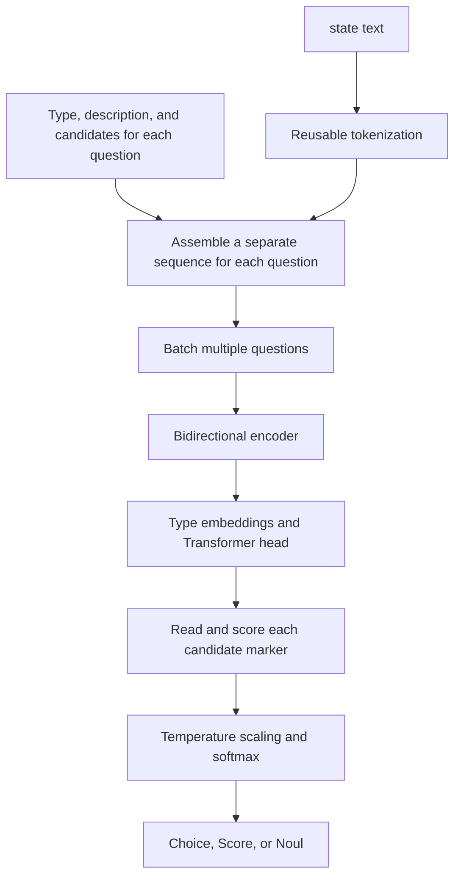

We're building an internal workspace called Agent Station. Lately, I've been thinking about a possibility: suppose the workspace gradually accumulates a large collection of knowledge bases and preset prompts. As those resources grow, **how do we put the right ones to work as soon as a user tells us what they need?**

Looking up product information, putting together a proposal, and troubleshooting a problem may all begin with one sentence in a text box. Behind the scenes, though, they can call for very different knowledge bases and prompts. We can hardly ask users to memorize the resource directory and assemble the right combination themselves. Ideally, they hand over a request, and the workspace helps it find its way.

That led me to Jev and Laya. Could Agent Station use a nimble little router to pick the right resources quickly, then pass the work to an agent that's ready to go? If that choice is both accurate and fast, the savings could extend beyond a single wait: less time choosing resources, explaining things again, and starting over after a wrong turn.

This is still an idea to test. I haven't completed deployments or head-to-head tests of the two in Agent Station. For now, I want to explain where they came from, why they might be faster, and what the public benchmarks actually show, then consider how to try this approach.

<!-- truncate -->

This article draws on public information available as of **October 2, 2026**. Benchmark numbers come from the official or third-party reports cited below; I have not rerun the models. The proposed Agent Station design and its potential benefits remain hypotheses to validate.

## Meet Jev and Laya

Jev comes from TypeSafe AI. Its founder, Diogo Almeida, previously contributed to work on InstructGPT. The team announced Jev and opened early access on September 15, 2026. They call this product direction **System One models**, emphasizing fast, structured judgments that software can consume directly. [Source: TypeSafe launch post](https://typesafe.ai/blog/introducing-system-one-models-and-jev)

System One borrows the idea of fast, intuitive judgment. It isn't a unified industry standard, nor does it mean the models have reproduced the two systems of human cognition. Classifiers, encoders, and probability calibration have been around for some time. The interesting question here is how they come together in a general-purpose developer interface.

Laya followed, developed by Nandakishor Mukkunnoth of ConvAI Innovations, with code in `NandhaKishorM/laya`. The author traces his approach to earlier research on predicting conversion in sales conversations. He explicitly says that, after Jev launched, he decided to extend that experience into a more general, open decision model. Version 0.1.0 of the `laya` package appeared on PyPI on September 18. That is the package's initial release date, which should not be treated as the date when all model weights became available. [Sources: Laya project introduction](https://laya.convaiinnovations.com/), [PyPI release history](https://pypi.org/project/laya/#history)

We can therefore say that Laya's public project appeared after Jev, and that its interface and product direction were clearly inspired by it. There is currently no public evidence that Laya inherited Jev's code, weights, or training implementation. Both use the name RLCD, but that alone does not establish that their training algorithms are the same.

The two already differ substantially in how they are delivered. Jev offers a hosted API without public weights for its core model. Laya provides code and open weights, supporting local deployment and domain fine-tuning. TypeSafe's open-source SDK does not make the Jev model itself open source. [Sources: TypeSafe model documentation](https://docs.typesafe.ai/models), [Laya repository](https://github.com/NandhaKishorM/laya)

Putting their current offerings side by side makes it easier to decide which to try first:

| Dimension | Jev | Laya |
| --- | --- | --- |
| Deployment | Hosted API | Local or self-hosted service |
| What's open | SDK and evaluation code; core weights are not public | Inference code, listed model weights, and fine-tuning tools |
| Domain adaptation | Adjust the state, questions, and application logic | Adjust the same inputs, with weight fine-tuning also available |
| Language and length | Performs best in English; the native API has both total-request and per-question budgets | Separate English, multilingual, and other checkpoints; routing and truncation need attention |
| Main engineering responsibilities | Network access, service rate limits, version updates, and data transmission | Hardware, dependencies, throughput, calibration, and model maintenance |

Jev lets you start by connecting to a service. Laya leaves more debugging and deployment choices in the developer's hands. Now let's take a closer look at how they answer questions.

## Give the little router a multiple-choice question

Ordinary chat models are good at elaborating on an answer. Routing often needs only a tiny output: which resources to choose, which prompt to use, or whether there's enough information to proceed. Jev and Laya give these judgments an explicit interface.

You supply `state`: the request and context needed for this decision. You also supply `questions`, specifying the question, candidate answers, or rating levels. Here, state means **the content passed into this particular call**. It doesn't mean the model already remembers everything in the workspace. The interface centers on three primitives. [Source: TypeSafe Introduction](https://docs.typesafe.ai/introduction)

| Primitive | What might Agent Station ask? | What the output means |
| --- | --- | --- |
| Choice | Which candidate prompt best fits the current task? | Selects one candidate and returns the probability of each option |
| Score | Has the user provided enough information to begin? | Returns a rating on an ordered scale and its probability distribution |
| Noul | Does this task require looking up an internal knowledge base? | Returns the probability of “yes,” from 0 to 1 |

Score requires predefined levels, such as “goal unclear,” “goal clear but key requirements missing,” and “ready to begin.” It works for ordered judgments like these, rather than arbitrary real-number calculations. [Source: Score documentation](https://docs.typesafe.ai/primitives/score)

Consider a hypothetical request: “Check the integration limits for Product A, then put together an explanation for a customer.” The system could first present a short candidate directory containing the product documentation, an integration FAQ knowledge base, and descriptions of prompts such as “technical troubleshooting” and “customer explanation.” The model would judge which resources fit. Downstream code would then load the configuration, retrieve the actual content, and assemble the task.

**The directory tells the model where to look; retrieval brings back the material.** Neither Jev nor Laya gains access to an entire knowledge base simply by receiving its name.

Modern generative models can also produce structured output. What's interesting here is the computation: Jev and Laya output judgments and probabilities directly, skipping the process of writing an answer token by token. Deterministic configuration, permissions, and execution logic remain the responsibility of code.

Some questions can be asked together. Jev's documentation recommends putting independent judgments into a single request, such as “Is retrieval needed?” and “Has the user specified the audience?” This reduces serial round trips. [Source: Speculative fan-out](https://docs.typesafe.ai/patterns/fan-out) If a later judgment depends on an earlier answer, however, that dependency must be handled explicitly. Parallel answers are not guaranteed to be mutually consistent, either. Code still needs to enforce mutual exclusions and business constraints.

## Why it can be fast

### Jev outputs the judgment directly

TypeSafe has disclosed a non-autoregressive, parallel output approach and a training direction called RLCD, or Reinforcement Learning for Calibrated Decisions. The aim is to output decision distributions directly, rather than write an answer token by token. [Source: TypeSafe AI primer](https://docs.typesafe.ai/introduction/machine-learning-primer)

As of this article, however, public information does not provide a sufficiently complete account of the core architecture, parameter count, or training recipe. We can discuss its observable behavior, but we cannot diagram it as a confirmed “small BERT,” or lump both models together as “small language models.”

Jev 1.13, the version listed in the current documentation, accepts text. It has a total budget of 64k tokens per request, with a 32k budget for `state` plus the longest individual question. It does not read images or audio directly, and customers cannot perform their own LoRA fine-tuning on the hosted weights. In practice, pin the version and record the model ID in the response so an alias update doesn't quietly invalidate your thresholds. [Source: Models](https://docs.typesafe.ai/models)

### Laya shows us where the computation happens

Laya's English base model uses ModernBERT-large, with approximately 421 million parameters. The multilingual version uses mmBERT-base, with approximately 322 million. The repository provides Apache-2.0 code, and the listed model cards also specify the corresponding open-weight licenses. When deploying, still check the exact model and revision you download. Sources: [code license](https://github.com/NandhaKishorM/laya/blob/4aa6761be8173de4ce6d92c31b3e40b6eaf59a7c/LICENSE), [English model card](https://huggingface.co/convaiinnovations/laya), [multilingual model card](https://huggingface.co/convaiinnovations/laya-multilingual).

In the public code, each question's type, description, candidate answers, and state are assembled into one input sequence. Markers are inserted before the candidates. The full sequence passes through a bidirectional encoder and additional Transformer layers. The representations at the candidate markers are then read to produce logits, which become probabilities through temperature scaling and softmax. Intuitively, the model reads the question and supporting material, then scores the candidates without first composing a written answer. There is no decoding loop generating the answer token by token. [Source: pinned common.py](https://github.com/NandhaKishorM/laya/blob/4aa6761be8173de4ce6d92c31b3e40b6eaf59a7c/laya/common.py)

This also shows why a multi-question interface doesn't mean the underlying context is encoded only once. Laya can batch questions into a forward pass, but each question still re-encodes its own sequence containing the state. What is shared is the tokenization cache. It isn't a case of “encode the context once, then add as many questions as you like for free.” [Source: agent batching implementation](https://github.com/NandhaKishorM/laya/blob/4aa6761be8173de4ce6d92c31b3e40b6eaf59a7c/laya/agent.py)

Candidate descriptions also consume the token budget. The default English checkpoint has a total length of 512 tokens; the multilingual checkpoint has 1,024. Only the space remaining after the question and options is available for state. A very long candidate list may lead to compressed descriptions. By default, overly long string or object states may lose information at the end, while conversations supplied as lists prioritize the most recent content. Even if the underlying model supports a longer context, check the actual configuration and what gets truncated. [Sources: input construction code](https://github.com/NandhaKishorM/laya/blob/4aa6761be8173de4ce6d92c31b3e40b6eaf59a7c/laya/common.py), [project usage guide](https://github.com/NandhaKishorM/laya/blob/4aa6761be8173de4ce6d92c31b3e40b6eaf59a7c/README.md)

Laya's public typed-decisions fine-tuning script also shows concrete training mechanics. It perturbs logits, constructs rewards using log score, spherical score, and ranked probability score for ordered rating tasks, then combines reward-based updates with a cross-entropy objective. Temperature can be fitted afterward. This implementation shows that RLCD is more than an interface label, but it does not establish that every historical set of weights was trained with exactly this script. It certainly doesn't let us infer Jev's training details. [Source: public fine-tuning script](https://github.com/NandhaKishorM/laya/blob/4aa6761be8173de4ce6d92c31b3e40b6eaf59a7c/notebooks/laya_finetune_typed_decisions_mps.py)

## Those probabilities look nice. Are they reliable?

Suppose a group of predictions all assign an event a probability of 0.8. If, over time, those events actually occur about 80% of the time, we can call that portion of the predictions reasonably well calibrated. Calibration describes a statistical relationship across a set of predictions. It cannot guarantee that any individual decision is correct. [Source: TypeSafe AI primer](https://docs.typesafe.ai/introduction/machine-learning-primer)

We also need to distinguish probability from `confidence`.

In the current Jev documentation, `confidence` for Choice and Score is a summary calculated from the existing probability distribution. It is not a separate, magical module that estimates “Did I understand this?” Noul has no separate `confidence` field. A concentrated distribution tells us the model is certain; it doesn't rule out being confidently wrong. [Source: Confidence](https://docs.typesafe.ai/confidence)

Laya's current implementation uses a different definition. Its `confidence` measures distribution concentration using normalized entropy, while `answer_confidence` is the probability of the selected answer. Abstention thresholds mainly use the latter. Similar field names conceal different calculations, so thresholds cannot simply be copied from one system to the other. [Sources: Laya probability handling](https://github.com/NandhaKishorM/laya/blob/4aa6761be8173de4ce6d92c31b3e40b6eaf59a7c/laya/common.py), [confidence gating](https://github.com/NandhaKishorM/laya/blob/4aa6761be8173de4ce6d92c31b3e40b6eaf59a7c/laya/confidence.py)

“The output conforms to its type” and “the judgment is semantically correct” are therefore different guarantees. A model can restrict its answer to the supplied candidates and still pick the wrong resource. Instructions hidden in the input can also push it toward the wrong answer. Jev's official known-issues page lists failures involving adversarial content, numerical precision, date comparisons, and long irrelevant context. [Source: Jev 1.13 jaggedness](https://docs.typesafe.ai/model-jaggedness/jev-1.13)

## A closer look at the public benchmarks

### The headline numbers are impressive. What do they compare?

At launch, Jev advertised a 193.6× speedup and a 444.6× cost reduction. Those figures came from four types of workflow designed by the team, with reference answers aggregated from predictions by strong models. The measurements therefore include agreement with reference models; they should not be read directly as human-verified business accuracy. The team also acknowledges that these gains sit toward the high end of real-world results, and that requiring full probability outputs from the LLM baselines increases their generation cost. [Sources: launch post](https://typesafe.ai/blog/introducing-system-one-models-and-jev), [public WorkflowEvals code and data](https://github.com/typesafe-ai/WorkflowEvals)

These materials do provide a starting point for closer inspection. But test location, workflow decomposition, and baseline output requirements all affect the results. The headline multipliers cannot be applied to every API request. Jev's native API is currently listed at US$0.042 per million input tokens, with no separate output charge. Whether it is inexpensive for you depends on your input volume, retries, and fallback rate. [Source: Models](https://docs.typesafe.ai/models)

Laya's homepage comparisons also need unpacking. The project's `BENCHMARKS.md` explicitly says that the Jev scores in its tables come from third-party reports, with differences in some prompts and sample counts. The typed-decisions score of 0.766 comes from a task-specific fine-tuned checkpoint, and a corresponding raw-results file has not yet been included. For the same task and 2,000 decisions, the committed records show 0.362 for the base English model, 0.3515 for the multilingual model, and 0.461 for the majority-class baseline. Treating the fine-tuned 0.766 as the base model's zero-shot capability would give a misleading picture of deployment difficulty. [Sources: pinned benchmark notes](https://github.com/NandhaKishorM/laya/blob/4aa6761be8173de4ce6d92c31b3e40b6eaf59a7c/BENCHMARKS.md), [raw T4 results](https://github.com/NandhaKishorM/laya/blob/4aa6761be8173de4ce6d92c31b3e40b6eaf59a7c/research/results/t4_colab_benchmark.json)

### How do they perform on the same questions?

On September 20, `elcronos/jev-vs-open-decision-models` documented a shared classification protocol and published per-example results, cached API responses, and environment snapshots. The results below use its plain setting: short English texts, one Choice question, the original label order, and no examples or task-specific tuning. [Source: pinned protocol](https://github.com/elcronos/jev-vs-open-decision-models/blob/a1901bc3d520e73936de8d4326545c0cdcf742fb/PROTOCOL.md)

The model versions matter. Jev was `typesafe/jev-1.13-20260917`. Laya used **package version 0.3.3 and the English base weights available at the time**, at weight revision `c5d7873…`. The evaluation did not test the later 0.3.23 release, the multilingual model, or task-specific fine-tuned weights.

Each result cell shows **accuracy / Macro-F1**, both expressed as percentages. N is the number of test texts; K is the number of candidate classes.

| Dataset | N / K | Jev | Laya English base |
| --- | --- | --- | --- |
| DAIR Emotion | 2,000 / 6 | 58.65 / 50.02 | 58.70 / 49.29 |
| Tweet Topic | 1,693 / 6 | 79.33 / 69.36 | 63.20 / 46.11 |
| Financial News Topic | 4,117 / 20 | 66.99 / 62.98 | 34.20 / 36.23 |
| DailyDialog single-utterance emotion | 7,740 / 7 | 70.99 / 38.47 | 61.43 / 27.48 |

Source: [cross-dataset summary](https://github.com/elcronos/jev-vs-open-decision-models/blob/a1901bc3d520e73936de8d4326545c0cdcf742fb/results/cross_dataset_summary.csv). This is a summary of published results, not a new inference run. Public inventories of training data remain incomplete, so a shared protocol does not prove that the models have never encountered the test content.

The picture is more specific than a claim that one model wins everywhere. On Emotion, their accuracy differs by just one example, with no statistically significant difference detected. In the other three settings, this version of Jev performs better. Most DailyDialog examples, however, belong to the “no emotion” class. Always selecting that majority class yields **81.67%** accuracy, and the test did not supply conversational context. Overall accuracy alone can obscure the ability to recognize minority emotions. [Source: summary statistics and baselines](https://github.com/elcronos/jev-vs-open-decision-models/blob/a1901bc3d520e73936de8d4326545c0cdcf742fb/results/cross_dataset_summary.json)

The probabilities are not automatically trustworthy, either. In financial-topic classification, Laya's mean top-class probability was about **95.2%**, while its accuracy was only **34.2%**, with an ECE15 of **0.6096**. This older result cannot stand in for the current version's calibration, but it is enough to make the point: reading a high probability is not the same as having a production-ready risk threshold. [Source: original task summary](https://github.com/elcronos/jev-vs-open-decision-models/blob/a1901bc3d520e73936de8d4326545c0cdcf742fb/results/fin_topic/summary.json)

If your application already has stable labels and training data, traditional classifiers should be in the comparison too. In a supplementary experiment from the same project, supervised TF-IDF plus logistic regression reached 82.75% on financial-topic classification. Its training conditions differ from those of zero-shot models, but it still raises a useful selection question: how large a model does this fixed task need? [Source: supplementary supervised experiments](https://github.com/elcronos/jev-vs-open-decision-models/blob/a1901bc3d520e73936de8d4326545c0cdcf742fb/results/supervised_models.json)

### Chinese-language use cases have been tested too

A more relevant reference for Chinese-language developers is `zh-decision-bench` v0.2. It contains 378 input items and 467 questions, covering routing from voice-command text and several kinds of business judgment. The table below covers five question categories. Each result cell shows **accuracy / ECE15**; lower ECE means lower binned calibration error in that test.

| Chinese-language task | N | Jev | Laya multilingual |
| --- | --- | --- | --- |
| Voice-command text routing | 323 | 0.960 / 0.035 | 0.870 / 0.056 |
| Customer-support routing | 34 | 0.882 / 0.107 | 0.618 / 0.311 |
| Customer-support urgency | 34 | 0.676 / 0.135 | 0.647 / 0.088 |
| Fraud or prohibited promotion | 21 | 0.952 / 0.073 | 0.714 / 0.286 |
| Whether to escalate | 55 | 0.600 / 0.164 | 0.564 / 0.230 |

Source: [v0.2 report](https://github.com/CodyQin/zh-decision-bench/blob/7cd016419bcb8291b1f3889c9c2bef92178da20c/reports/metrics.md). N is the number of questions in each category. The test used Laya 0.3.20. For Jev, only the `jev-latest` alias was recorded, without preserving the resolved version; the Laya weight revision was not archived either.

These results support testing on your own Chinese-language use cases. They do not establish a universal ranking of language capability. The voice-routing data comes from a mapping of MASSIVE, while the business examples are synthetic and were labeled by one person. Slices containing only twenty or thirty examples are particularly uncertain. The urgency row also reminds us that accuracy and calibration can move in different directions.

### Millisecond latency: which part is fast?

In the third-party evaluation above, Emotion P50 latency was 349.09 ms for Jev and 31.30 ms for Laya. The former measured successful remote API requests from an Australian client at concurrency 8. The latter measured local MPS FP32 inference on an M1 Max, with batch size 1 and 10 warm-up runs. These are real experiences of two deployment setups, but they do not isolate the speed difference between the neural network architectures. [Sources: evaluation summary](https://github.com/elcronos/jev-vs-open-decision-models/blob/a1901bc3d520e73936de8d4326545c0cdcf742fb/results/frozen_primary_plain/summary.json), [environment record](https://github.com/elcronos/jev-vs-open-decision-models/blob/a1901bc3d520e73936de8d4326545c0cdcf742fb/results/frozen_primary_plain/env.json)

A “single forward pass” does not mean constant computation, either. The number of questions, input length, and deployment location all affect latency. Self-hosting removes the per-call API bill, but hardware, memory, and operations still count toward the cost. For Agent Station, these numbers give the little-router idea a reason to be tested. To find out how much sooner users could get a usable result, we need to measure the whole path.

## Help Agent Station's resources get to work sooner

After looking through the models and benchmarks, what I most want to try is letting users spend less time wondering which resource to use. In this proposed setup, knowledge bases hold the material, preset prompts capture ways of doing the work, and routing connects both to the request at hand.

My earlier exploration focused more on reusing the same agent templates, Skills, and MCP across clients. I considered Skills and Hooks, then moved toward System Prompts, and later connected three clients through a web interface I built. Requests arriving directly through curl or a DingTalk bot do not automatically read the web-side configuration; the configuration still has to be fetched by querying the API through the CLI. That background explains my interest in routing. This time, though, I want to look one step further: **beyond choosing a role, can we make it easier to choose knowledge bases, prompts, and the way a task is handled together?**

*Conceptual illustration: inspect the resource directory, then choose a route. Retrieve the actual material only after selecting the knowledge bases. Routing can also return several candidates, or indicate that more information is needed.*

### Give each resource a useful little calling card

If the directory says only “Knowledge Base 1” and “General Assistant,” even a fast model will struggle to know what each one is good at. A practical starting point is a short description for every resource: which topics it covers, which tasks it suits, and when it should not be used, along with a stable ID and version. Prompts need the same treatment, including their intended goal, audience, and output format.

The system should first filter resources by the user's permissions, then give the router directory entries relevant to the request. With a large collection, tags, keywords, or vector search can narrow the candidates before Jev or Laya makes a further judgment. This candidate list needs to retain the relevant resources. If the first step has already missed the right knowledge base, the downstream model cannot select an option it never sees.

The router would usually receive **resource descriptions and the necessary context**. Product documentation, historical records, and long-form material would stay in the knowledge bases until the search scope has been chosen. That gives us a chance to reduce delays and distraction from irrelevant content. Packing every document into state could instead run straight into length limits.

### One request may need more than one helper

Choice selects one option from a candidate set, but real tasks aren't always multiple-choice questions with a single answer. The earlier request to check integration limits and prepare a customer explanation might need both product documentation and FAQs, plus a customer-facing writing prompt.

We could make separate judgments for “knowledge resources” and “prompt variant,” or assess the relevance of each knowledge base in a small candidate set, then combine the results in code. If we use Choice probabilities to retain several candidates, we should remember that they form a shortlist from a single-choice distribution. They are not independent probabilities that each knowledge base is relevant. Cross-base retrieval, result merging, and deduplication remain downstream work.

For prompts, I'd rather choose among variants that have already been reviewed, such as “quick answer,” “in-depth troubleshooting,” and “write it up” for the same subject. The router returns an ID that can be validated, and the execution layer loads the corresponding configuration. This avoids having the routing step invent a template that doesn't exist.

There also needs to be a door marked “not sure yet.” If a request is too vague, none of the candidates fits, or one request spans several tasks, the system can retain multiple candidates, ask a clarifying question, or hand off to a more general workflow. Always forcing a single choice may look decisive while merely leaving the trouble for later.

### The potential gains span the whole experience

If the choices are accurate enough, I see several concrete sources of improvement:

- Users can start work with less directory browsing and fewer prompt experiments
- Routing can reduce long-form generation and serial waiting
- Downstream retrieval can focus on relevant resources, leaving the agent less irrelevant material to read
- A better match between resources and tasks can reduce off-target answers, restarts, and changes of approach midway through

If these parts improve together, the efficiency gains could be substantial. For users who currently spend time repeatedly finding material and trying templates, fewer manual steps and less rework may matter more than a few dozen milliseconds. But I can't yet put a speedup multiplier on Agent Station.

Those gains have conditions. Candidate filtering needs enough recall, routing must not frequently choose the wrong resources, and extra retrieval or fallbacks must not consume the time saved. If every knowledge base and the entire prompt set still end up being sent to the large model unchanged, the earlier selection is unlikely to reduce input costs.

Several engineering basics also need to be settled: can every entry point retrieve the same configuration version, does each request actually pass through routing, and does the selected configuration take effect in the target client? Switching models will not solve these issues automatically. Routing doesn't grant permissions, either. Data access and tool calls still require independent checks. Getting those boundaries right is what makes a lightweight approach useful.

## How will we know the little router is helping?

I'd begin with a held-out set of real requests. It should cover tasks needing one knowledge base, cross-base searches, no retrieval, similar prompt variants, missing information, task changes midway through a conversation, and both Chinese and mixed Chinese-English inputs. At first, I'd let the router make suggestions on the side without changing execution, then inspect where its recommendations differ from what was actually needed.

The comparisons need to be fair, too. Record the current workflow, then test the same resource directory with rules or an existing model, and finally add Jev and Laya. Keep configuration caching, candidate filtering, and retrieval strategies as consistent as possible, rather than crediting the new model for improvements made elsewhere. If labels are stable and training data is available, a traditional classifier is worth including.

These are the results I'd focus on:

| Question to answer | What to measure |
| --- | --- |
| Did the right resources survive candidate filtering? | Candidate recall, especially resources missed in cross-base tasks |
| Did routing make the right choices? | Knowledge-base selection accuracy and recall, prompt-match quality, unnecessary retrieval, and missed retrieval |
| Which results are reliable enough to use automatically? | Calibration curves, Brier score or ECE, and error rates versus automatic-handling coverage at different thresholds |
| Is this actually less work for the user? | First-result usability, clarification and rework counts, manual selection steps, and human ratings of final quality |
| Is the path from request to result faster and cheaper? | End-to-end P50/P95, time spent in each stage, input volume, retries and fallbacks, and full API or self-hosting costs |

Record timings separately for candidate filtering, configuration lookup, routing, knowledge retrieval, and agent execution. Check whether they remain consistent across entry points, cold starts, and concurrency levels. That will tell us whether the delay comes from finding the route or doing the work itself.

Thresholds also need more than one attractive set of numbers. Keep the calibration set separate from the final test set, pin both the model and resource-directory versions, and separately test new resources, unfamiliar phrasing, long inputs, stale or invalid configurations, and manipulative text. High confidence will not automatically detect every unfamiliar situation. If most requests still need a large model to double-check the result, adding routing could make the workflow slower.

My final acceptance criterion is simple: while maintaining answer quality, users spend less effort deciding which resources to use and get a usable result sooner.

## Find the route, then let the task take the stage

What appeals to me about Jev and Laya is that they make “a quick judgment” into a distinct step we can design and optimize. Knowledge bases, prompts, and agents already have plenty to offer. A suitable router could help them work together more smoothly.

Jev provides a hosted service. Laya gives developers more room to inspect the implementation, deploy it, and fine-tune it. Public benchmarks haven't produced a winner for every setting, but they have pointed toward worthwhile experiments and highlighted differences in probabilities, languages, and versions.

For Agent Station, I want to test a simpler experience: users start by saying what they want to accomplish, and the system quickly prepares the right knowledge and approach. Let the little router find the way, so the good resources can get to work sooner.

## Sources and places to dig deeper

- [TypeSafe: Jev launch post](https://typesafe.ai/blog/introducing-system-one-models-and-jev), [developer documentation](https://docs.typesafe.ai/introduction), [WorkflowEvals](https://github.com/typesafe-ai/WorkflowEvals)
- [Laya: pinned code snapshot](https://github.com/NandhaKishorM/laya/tree/4aa6761be8173de4ce6d92c31b3e40b6eaf59a7c), [benchmark notes and results index](https://github.com/NandhaKishorM/laya/blob/4aa6761be8173de4ce6d92c31b3e40b6eaf59a7c/BENCHMARKS.md)
- [Third party: shared-protocol classification evaluation of Jev and open decision models](https://github.com/elcronos/jev-vs-open-decision-models/tree/a1901bc3d520e73936de8d4326545c0cdcf742fb)
- [Third party: Chinese decision benchmark zh-decision-bench v0.2](https://github.com/CodyQin/zh-decision-bench/blob/7cd016419bcb8291b1f3889c9c2bef92178da20c/reports/metrics.md)
