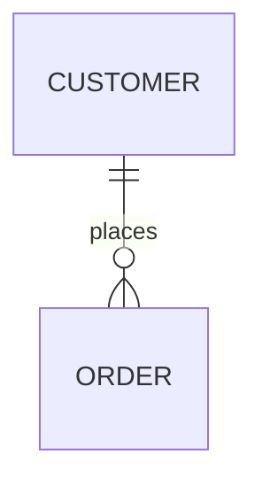

Upgraded Docusaurus from 3.6.2 to 3.9.2, bringing significant performance improvements and new features.

> Build speed improved by 3.8x, hot rebuild by 2x!

---

<!-- truncate -->

## 🚀 Version 0.6.0: Docusaurus 3.9 Performance Upgrade

### Core Upgrade

**Docusaurus:** `3.6.2` → `3.9.2`

This upgrade adapts new features from Docusaurus 3.7, 3.8, and 3.9, with a focus on introducing the **Docusaurus Faster** performance optimization suite for significant build speed improvements.

---

### 📊 Performance Comparison

Benchmark data based on React Native website (~2000 pages):

| Build Type | 3.6.2 | 3.9.2 + Faster | Improvement |
|------------|-------|----------------|-------------|
| Cold Build | ~120s | ~31s | **3.8x** 🔥 |
| Hot Rebuild | ~33s | ~17s | **2x** 🔥 |
| SSG Generation | - | - | **~2x** 🔥 |

For a site of this scale, build time is reduced from 1-2 minutes to 20-30 seconds, greatly improving the development experience.

---

### ✨ New Features & Optimizations

#### 1. Docusaurus Faster Performance Suite

Three core optimizations enabled:

```typescript
future: {
  experimental_faster: {
    rspackBundler: true,           // Rspack instead of Webpack
    rspackPersistentCache: true,   // Persistent cache
    ssgWorkerThreads: true,        // Worker Threads parallel SSG
  },
}
```

**Technical Details:**

- **Rspack Bundler**: Rust-based build tool by ByteDance team, much faster than Webpack
- **Persistent Cache**: Persists build cache for reuse, avoiding redundant work
- **Worker Threads**: Leverages multi-core CPUs for parallel static page generation, doubling SSG speed

**Notes:**
- Persistent cache requires preserving `./node_modules/.cache` directory
- CDNs like Vercel/Netlify handle this automatically
- First build is slower (building cache), subsequent builds are very fast

---

#### 2. Node.js Version Upgrade

**Requirement:** `>=18.0` → `>=20.0`

**Reasons:**
- Node.js 18 reached EOL in 2025, no more security updates
- `webpack-dev-server@4` dependency has security warnings
- Rspack 1.5+ requires Node.js >=18.12

**Impact:** Ensure all dev/production environments use Node.js >=20.0

---

#### 3. React 19 Support

Docusaurus 3.7 added React 19 support, already upgraded:

```json
"react": "^19.0.0",
"react-dom": "^19.0.0"
```

**Notes:**
- React 19 is the minimum requirement for Docusaurus v4
- Early upgrade ensures smooth transition to v4
- Currently supports both React 18 and 19

---

#### 4. Algolia DocSearch v4

Upgraded to DocSearch v4.6.0 for better search experience.

**New Features:**
- **AskAI**: AI-powered search assistant with conversational search
- Improved search relevance algorithm
- Better UI/UX

**Optional:** To enable AskAI, add to Algolia config:

```typescript
algolia: {
  appId: 'QXN8S92SP4',
  apiKey: '***',
  indexName: 'eaveluo',
  askAi: {
    assistantId: 'your-assistant-id', // Create at docsearch.algolia.com
  },
}
```

---

#### 5. SVGR Plugin Configuration

Docusaurus 3.7 extracted SVGR as a standalone plugin with customizable SVG optimization:

```typescript
presets: [
  [
    'classic',
    {
      svgr: {
        svgrConfig: {
          svgoConfig: {
            // Custom SVG optimization config
          },
        },
      },
    },
  ],
],
```

---

### 🎁 Other Improvements

#### Blog Enhancements (3.7)
- New author social icons: Bluesky, Mastodon, Threads, Twitch, YouTube, Instagram
- Front Matter supports `sidebar_label` for custom sidebar labels
- npm2yarn plugin supports Bun package manager

#### CSS Cascade Layers (3.8)
- v4 Future Flag enabled for early adaptation
- Higher priority for custom CSS, reducing style conflicts

#### Mermaid ELK Layout (3.9)
Support for more complex diagram layouts:

````markdown

````

#### i18n Optimization (3.9)
- Custom URL and baseUrl per locale
- Optimized build speed for non-i18n sites

---

### ⚠️ Notes

1. **Cache Directory**: Ensure CI/CD preserves `node_modules/.cache` (Vercel handles automatically)
2. **Node.js Version**: Ensure all environments use Node.js >=20.0
3. **Dependency Compatibility**: Custom plugins must be compatible with React 19

---

### 📈 Future Optimization Plans

#### Optional: Disable concatenateModules
For large sites, disabling this optimization can further improve build speed:

```typescript
future: {
  experimental_faster: {
    rspack: {
      optimization: {
        concatenateModules: false,
      },
    },
  },
},
```

**Trade-off:** JS bundle size increases ~3%, but build speed improves significantly (some sites report 4x cold build, 16x hot rebuild).

#### Optional: Enable AskAI
Add AI search assistant by creating an assistant on Algolia website.

---

## 📝 Version 0.7.0 Plans

### System
- [ ] Add PWA support
- [ ] Optimize mobile experience
- [ ] Explore more performance optimizations

### Content
Recently exploring RN compatibility with HarmonyOS and home server deployment solutions. Will share interesting findings不定期！

---

## 🔗 References

- [Docusaurus 3.7 Release Blog](https://docusaurus.io/blog/releases/3.7)
- [Docusaurus 3.8 Release Blog](https://docusaurus.io/blog/releases/3.8)
- [Docusaurus 3.9 Release Blog](https://docusaurus.io/blog/releases/3.9)
- [Docusaurus Faster](https://github.com/facebook/docusaurus/issues/10556)

---

*Published on 2026-02-26 | Last updated 2026-02-26*
