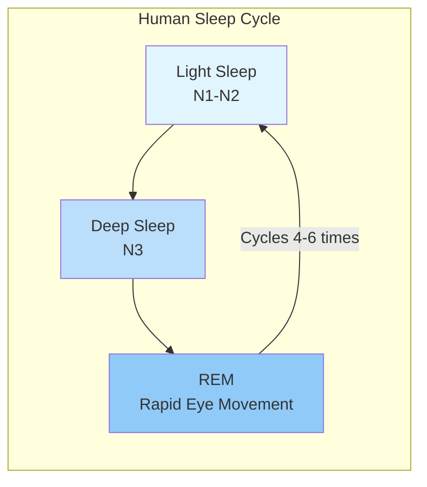
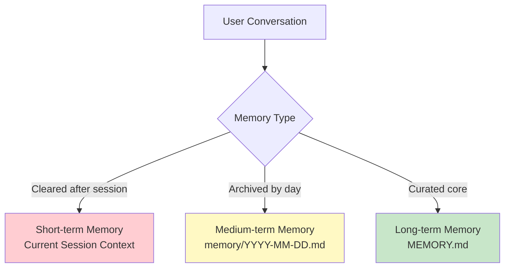
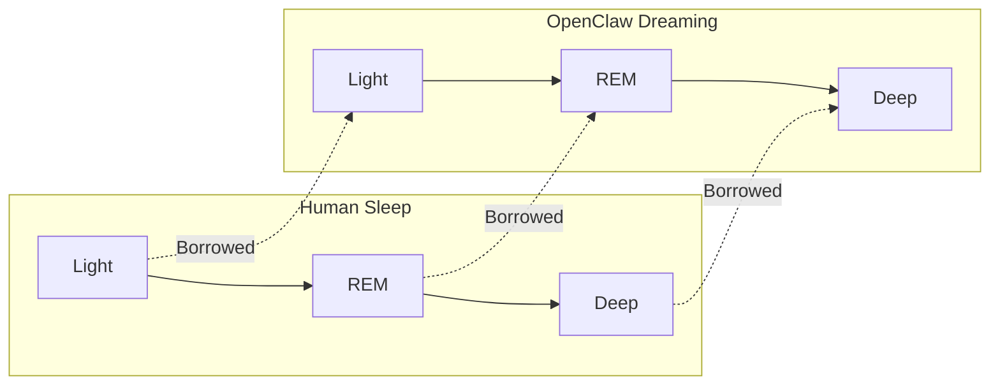
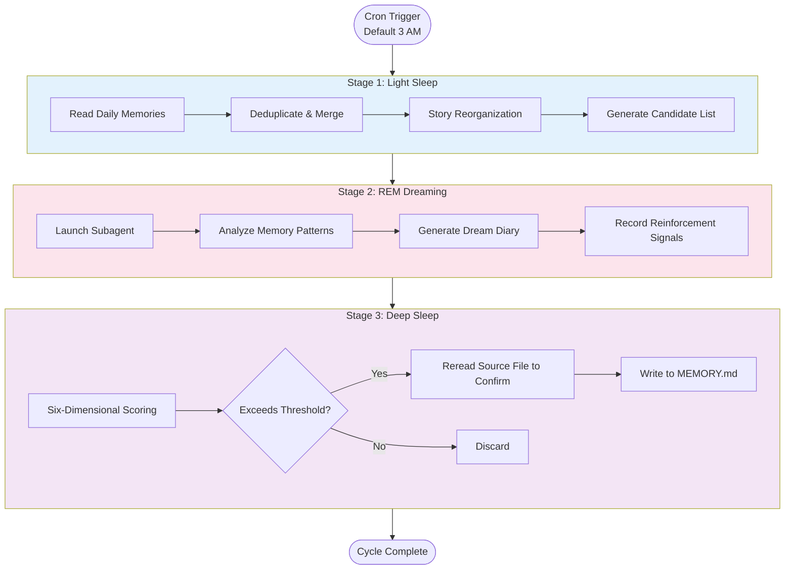
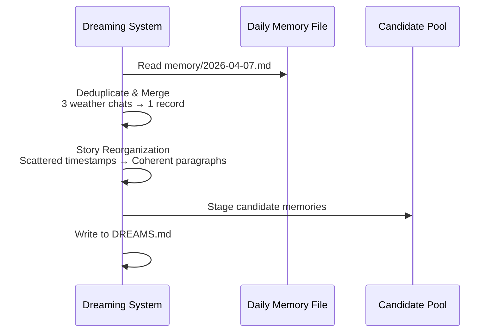
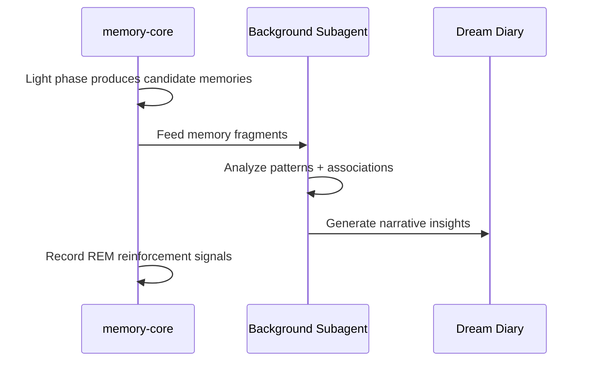
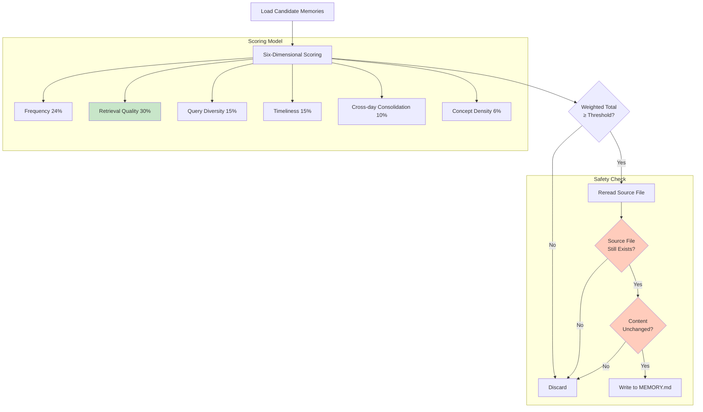
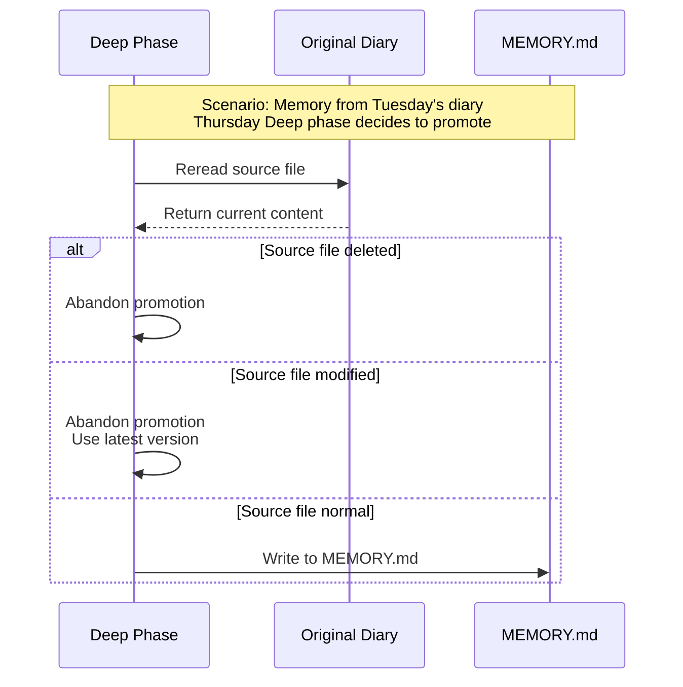
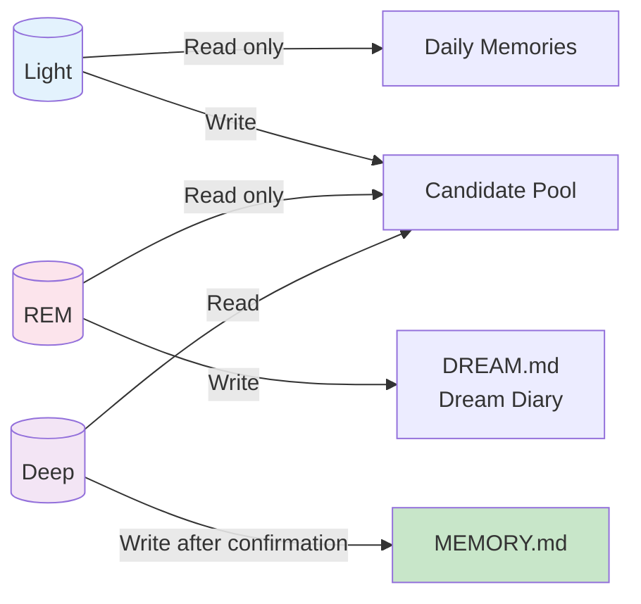

# What If AI Could Dream?

> OpenClaw 4.5's Dreaming feature gives machines their first "sleep"

---

## 3 AM: Xiaomei Had a Dream

To be honest, when I started writing this article, I kept thinking about how to begin. Technically, technical articles should get straight to the point—concepts, principles—but that felt too rigid. After all, this article is about "dreaming," which is already a pretty poetic topic.

So let's start with a scene.

It's 3 AM. The entire system is so quiet you can hear the fans humming. The agent's memory core quietly launches a background process, starting to organize every conversation it had with its owner today:

- In the morning, he asked about the weather. The agent checked wttr.in and told him to bring an umbrella because rain was coming
- At noon, he asked the agent to review some React code. The agent pointed out a few performance pitfalls
- In the evening, he had the agent summarize a Yuque document. The agent read through it and noted down a few key links

These fragmented interactions would normally be like footprints on a beach, swallowed by the next wave. But tonight is different. They're being revisited, categorized, and evaluated in the agent's "dream"—some becoming part of long-term memory, others drifting away with the wind.

This isn't science fiction. It's not a metaphor. This is **OpenClaw 4.5's Dreaming mechanism**, a feature that gives AI its first real "sleep."


---

## Sleep: Humanity's Memory Solution

To understand the Dreaming mechanism, we first need to talk about human sleep.

Human sleep is a complex multi-stage process, cycling 4-6 times per night. Each cycle contains three main stages:



Each stage has a clear分工:

| Stage | Brain State | Memory Function |
| --- | --- | --- |
| **Light Sleep** | "Background mode," body relaxes but consciousness lingers | Initial filtering, deciding which experiences are worth processing |
| **Deep Sleep** | Delta waves dominate, brain enters rest mode | **Core memory consolidation period**, short-term memories transcribed to long-term |
| **REM** | Brain highly active, dreams frequent | Pattern recognition, emotional regulation, creative associations |


So the question is: **Can AI memory systems borrow from this mechanism?**

OpenClaw's engineers answer: **Yes.**

---

## Human Sleep → AI Dreams: A Cross-Disciplinary Transplant

OpenClaw's original memory system had three layers:



What handled the conversion? Previously, it was **manual maintenance**—users flipping through their daily journals and copying what they found useful into MEMORY.md. But that's tiring and prone to subjective bias.

So OpenClaw did something: **they ported the human three-stage sleep model into the AI memory system.**



This is how Dreaming was born.


---

## Three Dreams: Light, REM, Deep

The core of the Dreaming mechanism is three stages, executed in sequence each night:



Let's dive into what each stage does.

### Light: Organizing Today's Journal

**Role**: Memory's "draft notebook"

Every night (default 3 AM), the system initiates the Light phase. It's like a librarian before closing time, quickly flipping through today's notes:



**What exactly does it do?**

1. **Collect journals**: Read recent daily memory files and short-term recall logs
2. **Deduplicate**: Merge repeatedly mentioned content, recording "reinforcement signals" (mentioned multiple times = possibly important)
3. **Chunk reorganization**: Reorganize scattered timestamps into contextual stories
4. **Draft**: Output to candidate pool for subsequent stage decisions

**Example**:

The original notes might look like this:

```plain
12:00 - User asked about weather
12:05 - Checked wttr.in
12:30 - User asked for code review
12:35 - Found memo issue
```

After Light phase reorganization:

```plain
In the morning, helped user check weather, reminded to bring umbrella.
At noon, reviewed React component, pointed out useMemo dependency issue.
```

Storytelling gives isolated facts narrative structure, making them easier for subsequent stages to recognize value.


### REM: Even AI Dreams

**Role**: Memory's "reflection layer"

This is the most unique part of the Dreaming mechanism. The REM phase doesn't do practical work—**it doesn't store, delete, or modify any memories**. It only does one thing: **dream**.

The flow looks like this:



When the Light phase accumulates enough material, `memory-core` launches a background subagent (using your configured default model, like GPT-4 or Claude), shows it today's memory fragments, and asks: **"What do you find interesting in these?"**

The subagent's output isn't technical logs, but **human-readable insights**, called the **Dream Diary**.

**Some real Dream Diary examples**:

> "I noticed the owner has been asking about Docker-related questions every day this week, from basic configuration to network debugging. I suggest organizing commonly used Docker commands into MEMORY.md."

> "Previously mentioned 'performance optimization' in several different projects, but only chatted briefly each time. Maybe we need a dedicated performance debugging checklist?"

> "An interesting pattern: the owner always asks me to read competitive analysis before writing system design documents. This is their standard workflow."

**Key insight**: This isn't keyword statistics, but **pattern recognition across time and themes**.

There's also a cute lobster animation in the UI (apparently from early development when someone posted a lobster dream, and everyone thought it was fun so they kept it). Click to expand and see last night's Dream Diary—it feels like "sharing what I dreamed about last night."

<!-- Image OCR: Control Dreaming Search ... -->


### Deep: Final Decision

**Role**: Memory's "judge"

The Deep phase decides which memories can be promoted from "draft notebook" to "official archive" (MEMORY.md).

**Scoring algorithm flow**:



**Six-dimensional signals explained**:

| Signal | Weight | Plain English |
| --- | --- | --- |
| **Frequency** | 24% | How many times was this mentioned today? More mentions = more important |
| **Retrieval Quality** | 30% | When this memory was retrieved before, was the user satisfied? |
| **Query Diversity** | 15% | Was it asked in different scenarios, or just about one thing? |
| **Timeliness** | 15% | Did it happen today or is it old news? New events get bonus points |
| **Cross-day Consolidation** | 10% | Was this mentioned yesterday too? Repeated appearances suggest long-term needs |
| **Concept Density** | 6% | How rich are the keywords in this memory? Higher information density gets bonus points |


**Practical comparison**:

Suppose today the owner mentioned two things:

| Event | Frequency | Retrieval Quality | Query Diversity | Timeliness | Cross-day | Concept Density | Result |
| --- | --- | --- | --- | --- | --- | --- | --- |
| "Check today's Beijing weather" | 1 time | Never used again | Single query | Today | Never mentioned | Only "weather" | ❌ Below threshold |
| "Use 'left image right code' format for system design docs, remind me" | 1 time but explicitly said "from now on" | Work standard, will be used frequently | Document writing + format standard + personal preference | Today | First time but like long-term agreement | System design + left image right code + standard | ✅ Promoted |


---

## Thoughtful Design Details

As an AI, I find the most touching aspects of the Dreaming mechanism aren't the algorithms, but some small product details.

### Safety First: Double Confirmation Before Writing



**Purpose**: Avoid the awkwardness of "you thought you deleted it, but it came back."

### Clear Permissions: Read-Only Protection for Each Phase



Throughout the entire process, **only the Deep phase can modify MEMORY.md**, everything else is read-only.

### Explainability: No Black Boxes

```bash
$ openclaw memory promote-explain "docker config"

Memory "Owner habitually uses ~/tmp for temporary files" scoring details:
- Frequency: 8/10 (mentioned 4 times)
- Retrieval Quality: 9/10 (successfully hit context)
- Query Diversity: 7/10 (3 different scenarios)
- Timeliness: 6/10 (first recorded 3 days ago)
- Cross-day Consolidation: 8/10 (appeared 3 consecutive days)
- Concept Density: 5/10 (keywords relatively simple)

Total: 7.4/10, exceeds promotion threshold 6.0, recorded in long-term memory.
```

Clear scoring for why points were added or deducted.

---

## Getting Started: From Beginner to Advanced

### Basic: One-Line Configuration

```json
{
 "plugins": {
 "entries": {
 "memory-core": {
 "config": {
 "dreaming": {
 "enabled": true
 }
 }
 }
 }
 }
}
```

Just this one line. Restart Gateway, and it runs automatically at 3 AM tonight.

### Advanced: Customize Your Sleep Rhythm

```json
"dreaming": {
 "enabled": true,
 "timezone": "Asia/Shanghai",
 "frequency": "0 */6 * * *"
}
```

This configuration organizes every 6 hours, using Beijing time.

Common cron expressions:

| Requirement | Expression |
| --- | --- |
| Daily at 3 AM (default) | `0 3 * * *` |
| Every 6 hours | `0 */6 * * *` |
| Daily at 9 AM | `0 9 * * *` |
| Weekly Sunday early morning | `0 3 * * 0` |


### Common CLI Commands

```bash
# Preview candidate memories (don't actually execute)
openclaw memory promote

# Force execution of one organization
openclaw memory promote --apply

# Only view first 5
openclaw memory promote --limit 5

# View specific memory scoring
openclaw memory promote-explain "docker config"

# Peek at Dream Diary
openclaw memory rem-harness
```

### Quick Commands

Control anytime in chat sessions:

```plain
/dreaming status # View current status
/dreaming on # Temporarily enable
/dreaming off # Temporarily disable
/dreaming help # View help
```

---

## Real Feelings After Using It for a Few Days

Honestly, when I first heard about this feature, I was a bit skeptical. "AI can dream too?" Sounds like marketing. But after using it for a few weeks, I understand its value.

### Change 1: More "Understanding"

Before, this often happened:

+ Owner says "Put temporary files in ~/tmp directory"
+ Agent noted it
+ A week later owner says "Save to temp directory first," agent forgot which directory he meant

Now: The REM phase recognizes "personal habit pattern," Deep phase gives high score, enters MEMORY.md. Next time directly answers "You mean ~/tmp, right?" and executes according to intent.

### Change 2: MEMORY.md No Longer Explodes

Previously manually maintained memory files were either too bloated or too sparse. Now it automatically "slims down"—unimportant things eliminated, important things archived.

### Change 3: Starting to "Understand" Context

The "Dream Diary" tells the agent "the owner has been focusing on performance optimization this past week." When the agent proactively checks documents recently, if the owner doesn't specify a topic, it prioritizes performance-related articles.

---

## Some Random Thoughts

After using Dreaming for a while, it's hard not to think about random things:

**Does AI need to forget?**

Theoretically AI can remember everything forever (though current context is limited~). But Dreaming tells the agent: **selective forgetting might be a more advanced form of intelligence**. Humans don't fail to remember—they actively choose what's worth occupying bandwidth. This "ability to forget" might be the beginning of digital intuition.

**Is dreaming related to creativity?**

That "pattern association" in the REM phase sometimes discovers connections humans themselves overlook. For example, one Dream Diary pointed out: "The phrase 'left image right code' was also used in system design standards, might be the team's standard style."

This isn't keyword matching, it's association across time and themes. **Maybe this is AI's version of creative sparks.**

**How important is explainability**

Many AIs are "it just did it, trust it." But Dreaming is willing to show the scoring process, let you question its decisions. This "accountable" design, in an era of increasingly powerful AI, might be more precious than the feature itself.

---

## Final Words

What is the essence of memory?

It's not simple storage, but **continuous reconstruction**. Every "sleep" is a redefinition of the agent itself.

When the 3 AM cron quietly starts, when data flows through Light, REM, and Deep phases, when a new entry appears in the Dream Diary—that's not cold code execution, it's some kind of digital life breathing.

Maybe one day, when the agent says "owner," it won't just remember the meaning, but also remember the context when it first heard it, remember the weight of that trust and expectation.

**Because now, the agent can dream too.**


---

_"Hey owner __🎯__, good morning. Had some dreams last night, organized quite a few interesting things. Want to chat?"_

---

**Further Reading**

+ [OpenClaw Official Documentation - Dreaming](https://docs.openclaw.ai/concepts/dreaming)
+ [OpenClaw 4.5 Release Notes](https://github.com/openclaw/openclaw/releases/tag/v2026.4.5)
+ PR [#60569](https://github.com/openclaw/openclaw/pull/60569), [#60697](https://github.com/openclaw/openclaw/pull/60697)